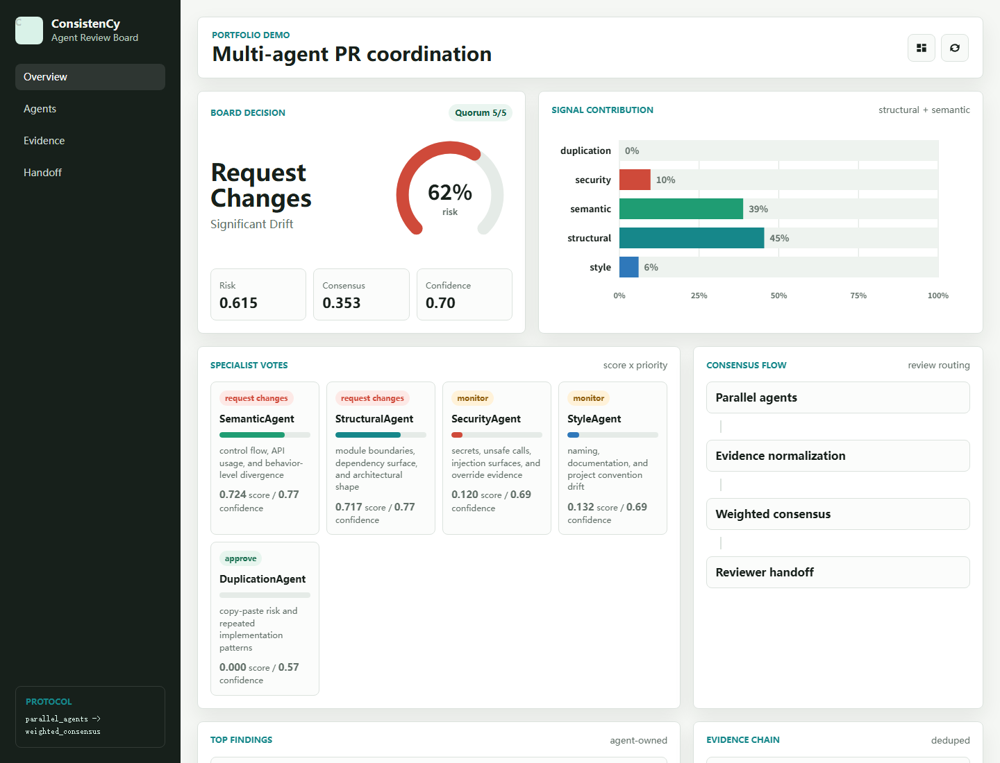

# ConsistenCy

[](https://github.com/sk1ua/ConsistenCy/actions/workflows/ci.yml)

ConsistenCy is a multi-signal code review assistant for pull requests. It compares a change against project history, runs specialist deterministic analyzers (optionally assisted by LLM review) to score different risk signals, and turns their evidence into an explainable reviewer handoff plan.

The project is designed as a portfolio-ready AI4SE system: small enough to run locally, but structured like a real review product with CLI commands, a Flask dashboard, GitHub App hooks, evaluation helpers, and reproducible tests.



## What It Does

- Builds project-specific baselines from Git history.
- Scores style, structure, semantics, duplication, security, and evolution drift.
- Coordinates specialist agent votes into a deterministic consensus decision.
- Produces explainable PR reports with evidence, confidence, top risky files, and review queues.
- Exposes the result through a CLI, Flask API, Markdown review comment renderer, and a dashboard showcase.

## Multi-Agent Review Board

Each *agent* is a specialist deterministic analyzer — a focused module that applies rules, metrics, and pattern detection rather than autonomous LLM reasoning.  An optional LLM review pass can augment the deterministic output when configured.

| Agent                | Focus                                                              |
| -------------------- | ------------------------------------------------------------------ |
| `StyleAgent`       | Naming, docs, and local convention drift                           |
| `StructuralAgent`  | Imports, coupling, inheritance, and module shape                   |
| `SemanticAgent`    | Control flow, API usage, and behavior-level change (proxy signals) |
| `DuplicationAgent` | Repeated implementation and clone risk                             |
| `SecurityAgent`    | Secrets, unsafe calls, injection-like patterns, override evidence  |
| `EvolutionAgent`   | Churn, hotspots, and history-aware PR risk                         |

The collaboration layer emits quorum, votes, disagreement notes, merge decision, top findings, and a reviewer handoff queue.

## Demo Surface

The screenshot above is generated from the `/showcase` route. It demonstrates the data visualization layer: risk gauge, normalized signal chart, agent vote cards, evidence chain, and reviewer handoff queue.

## Quick Start

```bash
python -m venv .venv
.venv\Scripts\activate
pip install -r requirements-dev.txt
```

Run the deterministic demo:

```bash
python examples/multi_agent_demo.py
```

Analyze two file versions:

```bash
python backend/cli.py analyze-file examples/demo_new.py examples/demo_base.py --json-output
```

Launch the web showcase:

```bash
python frontend/app.py
```

Then open:

```text
http://127.0.0.1:8000/showcase
```

## CLI Examples

Generate a PR-style report for a local Git repository:

```bash
python backend/cli.py pr-report --repo /path/to/repo --base main --head HEAD --json-output > report.json
```

Render a Markdown review comment:

```bash
python backend/src/review_suggestions.py report.json --output consistency-review.md
```

Analyze a remote GitHub repository:

```bash
python backend/cli.py analyze-remote pallets/flask --max-commits 20
```

## Project Layout

```text
ConsistenCy/
+-- apps/
|   +-- api/                  # TypeScript API shell
|   +-- web/                  # React/Vite dashboard shell
+-- backend/
|   +-- cli.py                  # CLI entrypoint
|   +-- github_app_server.py    # GitHub App webhook server
|   +-- src/
|       +-- agents/             # specialist analyzers
|       +-- collaboration/      # vote and consensus coordinator
|       +-- evaluation/         # metric and ablation helpers
|       +-- github_app/         # installation and webhook support
|       +-- models/             # typed report contracts
|       +-- parsers/            # Python / JS / TS parsing helpers
|       +-- remote/             # GitHub API based analysis
|       +-- scoring/            # risk composition and explainability
|       +-- pipeline.py         # orchestration
|       +-- review_suggestions.py
+-- frontend/
|   +-- app.py                  # Flask dashboard API
|   +-- templates/
|   +-- static/
+-- packages/
|   +-- schema/               # Shared TS/Zod report contracts
+-- schemas/                  # JSON Schema report contracts
+-- docs/
|   +-- PROJECT_OVERVIEW.md
|   +-- output_schema.md
|   +-- TYPESCRIPT_SHELL.md
|   +-- EVALUATION.md
|   +-- REMOTE_ANALYSIS.md
|   +-- GITHUB_APP_SETUP.md
+-- evaluation/                 # optional evaluation workspace
+-- examples/                   # runnable demo inputs
+-- tests/
```

## Evaluation

ConsistenCy ships an end-to-end public PR evaluation workflow:

```bash
# 1. Build a weak-label manifest from SWE-PRBench
python evaluation/scripts/build_public_pr_manifest.py \
  --hf-dataset foundry-ai/swe-prbench \
  --output evaluation/sampled_prs.json \
  --limit 50 --languages py,js,jsx,ts,tsx

# 2. Run ConsistenCy on every sample (clones into evaluation/repos/)
python evaluation/scripts/run_public_pr_reports.py \
  --manifest evaluation/sampled_prs.json \
  --repos-dir evaluation/repos --results-dir evaluation/results

# 3. Compute metrics + Markdown summary
python evaluation/scripts/run_metrics.py \
  --manifest evaluation/sampled_prs.json \
  --output evaluation/results/metrics_summary.json \
  --markdown-output evaluation/results/metrics_summary.md
```

Results table (placeholder until the sampled benchmark is run locally):

| Metric | Value |
|---|---:|
| Samples | pending |
| Evaluated | pending |
| Precision@3 | pending |
| Recall@3 | pending |
| Spearman | pending |

The public PR evaluation workflow is implemented as an automatic
weak-label benchmark: SWE-PRBench review comments provide the comparison
signal, and `run_metrics.py` reports `n/a` for rank metrics such as
Spearman when too few samples are evaluated. Manual audit is optional and
only needed for stronger research claims. See
[Evaluation workflow](docs/EVALUATION.md) for the full procedure.

## Limitations

- Multi-agent here means **deterministic specialist analyzers plus
  consensus coordination**, not autonomous LLM agents.
- `SemanticAgent` uses AST / API / control-flow **proxy signals**, not
  formal semantic equivalence.
- Public review comments are **weak labels**. They support an automatic
  ranking benchmark, but manual audit is still needed before treating the
  labels as gold-standard research annotations.
- Remote analysis quality depends on the parent commit being available
  via the GitHub API and on rate limits; the per-file `baseline_strategy`
  field reports whether each comparison used the parent commit, a
  language template, or an empty baseline.

## Documentation

- [Project overview](docs/PROJECT_OVERVIEW.md)
- [Output schema](docs/output_schema.md)
- [Evaluation workflow](docs/EVALUATION.md)
- [Remote repository analysis](docs/REMOTE_ANALYSIS.md)
- [GitHub App setup](docs/GITHUB_APP_SETUP.md)
- [Contributing](CONTRIBUTING.md)

## Testing

```bash
python -m pytest -q
node --check frontend/static/js/showcase.js
```

The current release-ready workspace passes the full Python test suite and browser-verifies the `/showcase` dashboard.

## GitHub Release Hygiene

Before publishing a branch or opening a PR:

```bash
python examples/multi_agent_demo.py
python -m pytest -q
node --check frontend/static/js/showcase.js
git status --short
```

Generated caches, local databases, evaluation result dumps, and cloned evaluation repos are ignored by default.

## Status

ConsistenCy is a research prototype and portfolio project. Python analysis is the strongest path; JavaScript and TypeScript parsing are supported where tree-sitter dependencies are available. The scoring layer is deterministic by design so that behavior is reproducible and easy to evaluate.
