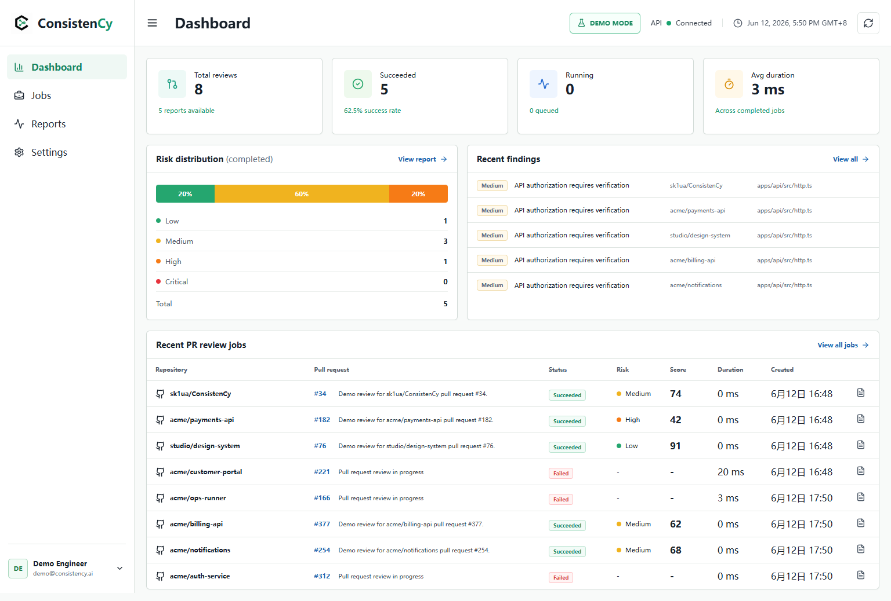
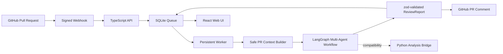

# ConsistenCy

[](https://github.com/sk1ua/ConsistenCy/actions/workflows/ci.yml)

ConsistenCy is a GitHub App-based multi-agent pull request review platform. It receives signed PR webhooks, creates durable review jobs, builds a bounded PR context, runs a LangGraph.js review workflow, persists evidence-backed reports in SQLite, publishes a concise GitHub comment, and exposes the result through a React Web UI.



## Core Features

- GitHub App installation-token authentication with signed, idempotent webhooks.
- Persistent SQLite queue for webhook deliveries, jobs, agent runs, reports, and comment status.
- LangGraph.js workflow with Planner, Security, Correctness, Maintainability, Test, Style, and Synthesizer nodes.
- LangChain-compatible Mock, DeepSeek, and OpenAI providers with strict zod output validation.
- Evidence rules: confirmed findings require file, line range, evidence, reasoning, and remediation.
- React + TypeScript dashboard for review history, risk distribution, findings, agent runs, and runtime status.
- Existing Python analyzers retained behind a compatibility bridge.
- CI that runs without external model keys and preserves review artifacts even when PR commenting fails.

## Technology Stack

| Layer | Technology |
| --- | --- |
| Orchestration | TypeScript, Node.js 22, LangGraph.js, LangChain.js |
| Contracts | zod, shared npm workspace package |
| GitHub | GitHub App, Octokit, HMAC webhook verification |
| Persistence | SQLite, better-sqlite3, migrations |
| Web UI | React 19, TypeScript, Vite, Lucide icons |
| Analysis compatibility | Python 3.12, existing deterministic analyzers |
| Quality | Vitest, pytest, Ruff, GitHub Actions |

## Architecture



The current graph executes specialist nodes sequentially while preserving separate node contracts and state reducers for future parallel execution. See [Architecture](docs/architecture.md) and [LangGraph agent design](docs/langgraph-agent-design.md).

## Local Start

Requirements: Node.js 22+, Python 3.12+, npm, and Git.

```powershell
npm install
python -m pip install -r requirements-dev.txt
Copy-Item .env.example .env
```

The default provider is `mock`. Set `LLM_PROVIDER=deepseek` with `DEEPSEEK_API_KEY` to use the preferred real-model provider. If `LLM_PROVIDER` is omitted entirely, a configured DeepSeek key is selected automatically.

Start the API and Web UI in separate terminals:

```powershell
npm run dev:api
npm run dev:web
```

Open `http://127.0.0.1:5173`.

## Demo Mode

Demo Mode works without a GitHub App or real model key. Start both services, then use the UI's demo action or call:

```powershell
$headers = @{ Authorization = "Bearer $env:CONSISTENCY_API_TOKEN" }
Invoke-RestMethod -Method Post http://127.0.0.1:8787/demo/seed -Headers $headers
```

The seed is idempotent and creates eight review jobs with varied states and risk levels. See [Demo guide](docs/demo.md).

## GitHub App Flow

1. GitHub sends a `pull_request` webhook.
2. The API verifies `x-hub-signature-256` and deduplicates `x-github-delivery`.
3. A `PR_REVIEW` job is persisted in SQLite.
4. The worker creates an installation token and builds a bounded workspace context.
5. LangGraph agents produce zod-validated findings and a synthesized report.
6. The report is persisted before GitHub comment publication.
7. Comment failure is recorded but does not fail the completed review job.

Setup instructions: [GitHub App setup](docs/github-app-setup.md).

## Testing

```powershell
npm run typecheck
npm test
npm run build
python -m pytest -q
npm audit --omit=dev
```

Or run the combined local gate:

```powershell
npm run verify
```

CI always uses `LLM_PROVIDER=mock`; no real GitHub App or LLM secret is required for tests.

## Environment Variables

The complete template is [.env.example](.env.example). Production requires explicit allowed origins, an API token, GitHub App ID, private key, and webhook secret. Secrets are never returned by configuration APIs.

## Documentation

- [Architecture](docs/architecture.md)
- [GitHub App setup](docs/github-app-setup.md)
- [LangGraph agent design](docs/langgraph-agent-design.md)
- [Demo and recording guide](docs/demo.md)
- [Security model](docs/security.md)
- [Web API](docs/api.md)
- [Evaluation workflow](docs/EVALUATION.md)

## Future Work

- Execute independent specialist agents in parallel LangGraph branches.
- Add authenticated user sessions or an identity-aware reverse proxy for production Web UI access.
- Add repository-level policy profiles and inline GitHub review comments.
- Introduce retry/backoff and dead-letter handling for external provider outages.
- Expand benchmark coverage with manually audited PR review labels.

## Resume Description

**ConsistenCy: Multi-Agent PR review platform based on GitHub App**

- Built a full-stack code review platform with TypeScript, React, GitHub App, and Webhook integrations, including installation-token authentication, PR diff context construction, persistent job execution, and Web UI reporting.
- Designed a Planner / Security / Correctness / Test / Maintainability / Style / Synthesizer Multi-Agent workflow with LangGraph.js and LangChain.js, with provider-independent structured output.
- Enforced zod contracts for findings and reports, and persisted webhook deliveries, jobs, agent runs, and reports in SQLite for traceability and restart recovery.
- Implemented a React Web UI for risk scores, evidence-backed findings, agent timelines, job history, and Demo Mode, suitable for screenshots and recorded demonstrations.
- Hardened API authentication, webhook signatures, CORS allow lists, workspace path access, secret redaction, and CI/CD checks while keeping GitHub comment failures non-fatal.
