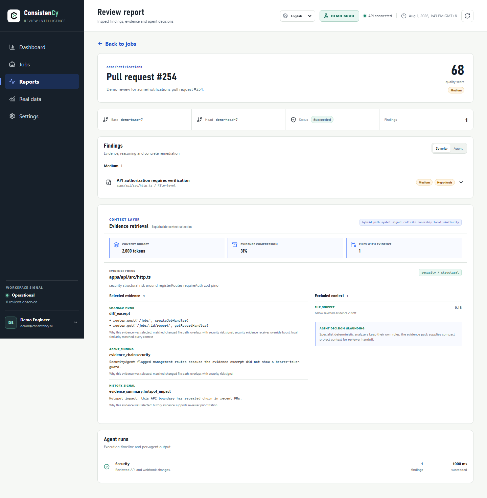

# ConsistenCy

**Evidence-driven review infrastructure for GitHub pull requests — deterministic analysis first, LLM as an optional layer.**

GitHub Pull Request 的证据驱动审查基础设施：Python 确定性引擎产出可复现的风险信号与证据，TypeScript 编排服务负责任务、工作区与可靠发布——让审查者先看到最值得看的文件、证据和原因。

[](https://github.com/sk1ua/ConsistenCy/actions/workflows/ci.yml)

审查者的瓶颈不是写评论，而是判断**哪个 PR、哪个文件、哪一行值得花时间**。ConsistenCy 不替代审查者：它把确定性分析、证据检索和审查编排做成一条可测试、可复现的流水线，每个 finding 都带 Evidence Pack——文件、行号，以及选择它的原因。

| | 普通 LLM Code Review | ConsistenCy |
| --- | --- | --- |
| 风险信号 | LLM 通读 diff 的直觉 | 确定性多信号分析，可复现、可测试 |
| 输出 | 一段散文评论 | 结构化报告 + Evidence Pack（行号级证据） |
| LLM 角色 | 唯一来源，不可替换 | 可选增强；MockLLM 可替换、测试可锁定 |
| 评论发布 | 直接调 API，失败即丢 | SQLite Outbox + 租约 + fencing token + 幂等更新 |

## 审查流水线

```text
Trigger → Context → Deterministic Analysis → Planner → Optional LLM Agents → Compose → Synthesizer → Persist → Outbox → PublishWorker → GitHub
```

确定性分析永远先于 LLM；LLM 不可用时，流水线仍然产出完整的风险报告。各阶段职责见[架构文档](docs/architecture.md)。

## 架构


实线为同步数据流，虚线为外部边界；三个 SQLite 存储分别承担 Job、Report 与 Outbox 职责。图源（Mermaid）：[system-architecture](docs/diagrams/system-architecture.mmd)、[review-lifecycle](docs/diagrams/review-lifecycle.mmd)、[job-state-machine](docs/diagrams/job-state-machine.mmd)。

## Demo

| Dashboard | Report |
| --- | --- |
|  |  |

*Demo Mode：固定 seed + MockLLM，不访问 GitHub，覆盖 Dashboard → Jobs → Report 完整流程。*

## 已验证的公开数据


*[espnet/espnet #6327](https://github.com/espnet/espnet/pull/6327) 的本地导入快照（非实时 GitHub 连接）：GitHub 观测事实、模型推导排名与公开 Review 弱标签在页面中分栏标注；弱标签只是有限的基准信号，不是缺陷金标准。*

## 30 秒运行

环境基线：Node.js 22.x、Python 3.12。

```bash
npm ci
python -m pip install -r requirements-lock.txt
cp .env.example .env
npm run dev:api    # 终端 1 · API: http://127.0.0.1:8787
npm run dev:web    # 终端 2 · Web: http://127.0.0.1:5173
curl -X POST http://127.0.0.1:8787/demo/seed   # 写入固定 Demo 数据
```

Windows PowerShell：

```powershell
npm ci
python -m pip install -r requirements-lock.txt
Copy-Item .env.example .env
npm run dev:api    # 终端 1 · API: http://127.0.0.1:8787
npm run dev:web    # 终端 2 · Web: http://127.0.0.1:5173
Invoke-RestMethod -Method Post http://127.0.0.1:8787/demo/seed
```

打开 <http://127.0.0.1:5173>。配置了 `CONSISTENCY_API_TOKEN` 时，seed 请求需要 `Authorization: Bearer` 头。全栈 E2E 使用隔离的临时端口 `3001`，不会碰本地开发数据库。

## 能力矩阵

| 能力 | 当前实现 |
| --- | --- |
| GitHub 入口 | Webhook（HMAC 校验）、PR Context、GitHub App 鉴权 |
| 确定性分析 | Python 多信号风险分析、证据检索、Evidence Pack |
| 审查编排 | Trigger → Context → Deterministic → Planner → Optional LLM Agents → Compose → Persist |
| 可靠发布 | SQLite Outbox、租约、fencing token、幂等更新；崩溃恢复不产生重复评论 |
| 跨语言协议 | 严格 JSON-over-stdio、Correlation ID、双端 Zod Schema 校验 |
| 可复现 | MockLLM、固定 Demo Seed、隔离全栈 E2E、公开 PR 弱标签评估 |

## 安全与评估边界

- 仓库内容、diff、Issue/Review 文本一律按不可信输入处理；进入 LLM 的静态分析内容有明确的边界与长度预算。
- Demo 只验证产品流程与 UI，不代表真实 GitHub 发布能力；生产发布需要 GitHub App、HTTPS、密钥管理与显式 CORS。
- 风险分数是审查注意力的排序信号，不是漏洞证明；公开 Review 只能作为弱标签，Precision/Recall 不能替代人工审查。
- 本地运行不会自动清理被 `.gitignore` 忽略的评估 clone、缓存与 SQLite 数据。详见[安全边界](docs/security.md)。

## 文档

- **使用**：[Demo](docs/demo.md) · [GitHub App 设置](docs/GITHUB_APP_SETUP.md) · [HTTP API](docs/api.md)
- **架构**：[项目概览](docs/PROJECT_OVERVIEW.md) · [架构](docs/architecture.md) · [输出 Schema](docs/output_schema.md) · [安全](docs/security.md)
- **评估**：[评估边界](docs/EVALUATION.md) · [评估工作区](evaluation/README.md) · [数据集 Schema](evaluation/dataset_schema.md)
- **贡献**：[CONTRIBUTING](CONTRIBUTING.md)

## 验证

```bash
npm run verify   # runtime 基线 + docs + 依赖审计 + typecheck + 单测 + build + pytest + E2E
```
