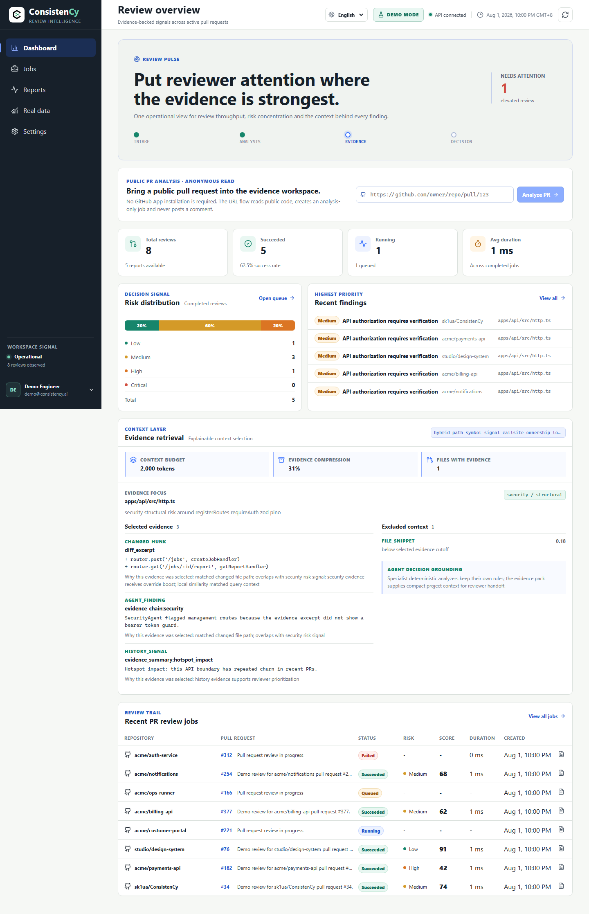
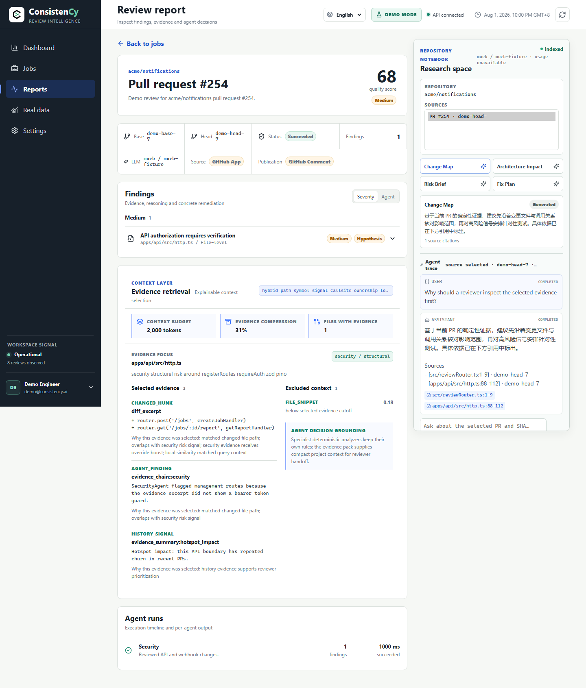
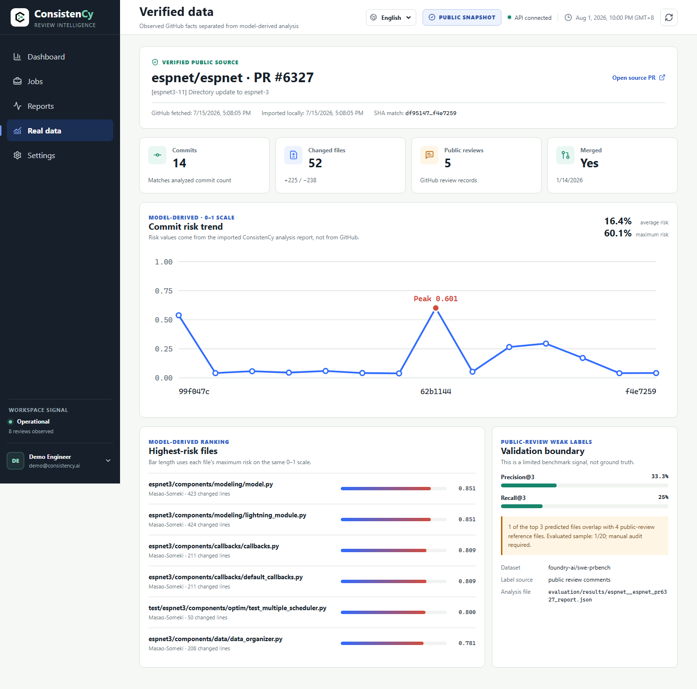

# ConsistenCy

**Evidence-driven review infrastructure for GitHub pull requests — deterministic analysis first, LLM as an optional reasoning layer.**

ConsistenCy 把代码审查拆成两个清晰的职责：TypeScript 编排任务、上下文、LLM 和发布；Python 引擎只做可复现的确定性分析。结果不是一段没有出处的评论，而是带文件、行号、证据和风险边界的 ReviewReport。

[](https://github.com/sk1ua/ConsistenCy/actions/workflows/ci.yml)

## 为什么不是普通的 LLM Code Review

| 维度 | 普通 LLM Review | ConsistenCy |
| --- | --- | --- |
| 风险信号 | 直接把 diff 交给模型判断 | 确定性分析先产出可复现信号 |
| 输出 | 一段难以追溯的散文 | 结构化报告 + Evidence Pack + 文件行号 |
| LLM 角色 | 常常是唯一判断来源 | 可选的解释、规划和综合层 |
| 发布 | 请求成功就直接评论 | SQLite Outbox、租约、fencing token 和幂等更新 |
| 公开 PR | 取决于部署方式 | 可匿名只读分析，永不发布评论 |

## 架构

```text
Web → TypeScript API → Review Worker → Python deterministic engine
                                  → SQLite / ReviewReport
                                  → Outbox → Publish Worker → GitHub comment
```


架构事实以 [system-architecture.mmd](docs/diagrams/system-architecture.mmd)、[review-lifecycle.mmd](docs/diagrams/review-lifecycle.mmd) 和 [job-state-machine.mmd](docs/diagrams/job-state-machine.mmd) 为准；SVG 只是便于在 GitHub 页面阅读的导出物。

审查流水线为：

```text
Trigger → Context → Deterministic Analysis → Planner → Optional LLM Agents
        → Compose → Synthesizer → Persist → Outbox → Publish Worker
```

确定性分析即使在 LLM 不可用时也会完成。Webhook 任务可以发布 GitHub 评论；公开 URL 任务使用独立的只读访问模式，不会创建评论 Outbox。

## Demo

| Dashboard | Report + Repository Notebook |
| --- | --- |
|  |  |

| Real Data (espnet/espnet #6327) |
| --- |
|  |

这些截图来自固定 Demo seed、MockLLM 及可信公开数据集，不代表实时外部服务结果。更多页面证据位于 [docs/screenshots](docs/screenshots/README.md)。

## 公开 PR与 Repository Review Notebook

在 Dashboard 的 **Analyze a public GitHub PR** 输入框中粘贴：

```text
https://github.com/espnet/espnet/pull/6327
```

公开读取支持两种服务端访问源：

| 模式 | 需要 GitHub App 安装 | 需要 Token | 评论权限 |
| --- | ---: | ---: | ---: |
| Demo Mode | 否 | 否 | 无 |
| Public Read — Anonymous | 否 | 否 | 无 |
| Public Read — PAT | 否 | 本地只读 PAT | 无 |
| Webhook Review | 是 | App 私钥 | 可按既有策略发布 |

公开 URL 会锁定 repository、PR number、base SHA 和 head SHA，创建 `accessMode=public_read`、`publicationPolicy=disabled` 的 Job。它只读取公开 PR、生成报告和 Notebook，不调用 GitHub App installation API，不写文件，不执行命令，不应用补丁，也不发布评论。

Notebook 是报告右侧的来源驱动研究空间：

- Change Map、Architecture Impact、Risk Brief、Fix Plan 四类分析卡片；
- 按 `repository + PR + head SHA` 隔离的索引和引用；
- SSE 流式回答、工具事件、provider/model 和 token usage；
- `generate_patch` 只返回 unified diff 文本，明确未应用、未执行测试。

## 30 秒启动

环境基线：Node.js 22.x、Python 3.12。

```bash
npm ci
python -m pip install -r requirements-lock.txt
cp .env.example .env
npm run dev:api    # API: http://127.0.0.1:8787
npm run dev:web    # Web: http://127.0.0.1:5173
curl -X POST http://127.0.0.1:8787/demo/seed
```

Windows PowerShell：

```powershell
npm ci
python -m pip install -r requirements-lock.txt
Copy-Item .env.example .env
npm run dev:api    # API: http://127.0.0.1:8787
npm run dev:web    # Web: http://127.0.0.1:5173
Invoke-RestMethod -Method Post http://127.0.0.1:8787/demo/seed
```

配置 `CONSISTENCY_API_TOKEN` 后，浏览器和 API 请求需要 `Authorization: Bearer <CONSISTENCY_API_TOKEN>`。公开 PR 分析默认在开发环境启用；如果配置 `GITHUB_PUBLIC_READ_TOKEN`，它只留在 API 进程中，不会传给 WebUI 或写入数据库。全栈 E2E 使用隔离数据和临时 API 端口 `3001`。

## HTTP 入口

| 能力 | 路径 |
| --- | --- |
| 健康状态 | `GET /health` |
| Job 与报告 | `GET /jobs`、`GET /jobs/:id`、`GET /jobs/:id/report` |
| 公开 PR 入队 | `POST /reviews/public-pr` |
| Notebook | `GET /notebooks/:id`、`POST /notebooks/:id/messages`、`POST /notebooks/:id/cards` |
| GitHub Webhook | `POST /github/webhook` |
| Demo 数据 | `POST /demo/seed` |

完整请求、SSE 事件和错误码见 [HTTP API](docs/api.md)。

## 能力矩阵

| 能力 | 当前实现 |
| --- | --- |
| GitHub 入口 | HMAC Webhook、PR Context、GitHub App 鉴权 |
| 公开 PR | 严格 URL 校验、匿名/PAT 读取、SHA 锁定、analysis-only Job |
| 确定性分析 | Python 多信号风险分析、Evidence Pack、边界预算 |
| LLM 层 | Mock、DeepSeek、OpenAI；结构化输出和 Notebook SSE |
| Repository Notebook | SHA 隔离索引、只读工具、强制引用、四类卡片 |
| 可靠发布 | SQLite Outbox、租约、fencing token、重试和幂等评论 |
| 跨语言协议 | JSON-over-stdio、Correlation ID、双端 Schema 校验 |
| 可复现性 | Demo seed、固定 MockLLM、隔离全栈 E2E 和公开数据快照 |

## 安全与边界

- 公开读取只接受 `https://github.com/{owner}/{repo}/pull/{number}`，遵守 GitHub API 限流；匿名读取约 60 次/小时/IP，可用本地只读 PAT 提高限额。
- PAT 仅作为服务端环境变量使用；日志、错误、SSE 和 WebUI 不显示 token、私钥或 Authorization header。
- 仓库内容、diff、评论和静态分析输出都按不可信输入处理；LLM 不是安全策略的唯一执行点。
- Notebook 没有 shell、写文件、测试执行、补丁应用或 GitHub 评论权限。
- 风险分数和公开 Review 只能作为审查排序信号，不能替代人工判断或缺陷金标准。

详见 [安全边界](docs/security.md)、[公开 PR API](docs/api.md) 和 [Repository Notebook](docs/notebook.md)。

## 文档导航

- **开始使用**：[Demo](docs/demo.md) · [HTTP API](docs/api.md) · [GitHub App 设置](docs/GITHUB_APP_SETUP.md)
- **理解架构**：[项目概览](docs/PROJECT_OVERVIEW.md) · [架构](docs/architecture.md) · [Repository Notebook](docs/notebook.md)
- **数据与评估**：[输出 Schema](docs/output_schema.md) · [评估边界](docs/EVALUATION.md) · [评估数据集 Schema](evaluation/dataset_schema.md)
- **贡献与安全**：[CONTRIBUTING](CONTRIBUTING.md) · [安全边界](docs/security.md)

## 验证命令

```bash
npm run verify:runtime
npm run verify:docs
npm run typecheck
npm test
npm run build
python -m ruff check engine tests evaluation/scripts examples
python -m pytest -q
npm run test:e2e
```
