# 架构

ConsistenCy 的事实架构由 `apps/api`、`engine`、`packages/schema` 和 SQLite 实现；下图的 Mermaid 源文件位于 `docs/diagrams/`，导出 SVG 用于文档展示。



## 组件职责

| 组件 | 职责 |
| --- | --- |
| React/Vite Web | Dashboard、Jobs、Report、Real Data、Settings |
| TypeScript API | HTTP、Webhook、GitHub context、配置、Job/Report API |
| ReviewWorker | 领取审查任务，协调 context、Engine、Planner、Agents 和持久化 |
| Python Engine | 确定性分析、证据检索和 report 片段；不负责 GitHub 或 UI |
| SQLite | Job、Report、Agent runs、发布 Outbox、租约和幂等标记 |
| PublishWorker | 从 Outbox 异步发布 GitHub 评论，处理租约、重试和 token 刷新 |
| GitHub | Webhook、PR 数据、Review 数据和最终评论发布 |

## 审查生命周期



主线为同步流水线；虚线注记表示 LLM 可以整体缺席，Evidence Pack 同时服务 Planner 与 Compose。

## JSON-over-stdio 边界

TypeScript 启动并复用 Python 子进程，以一行一个 JSON 请求/响应通信。wire contract 使用 `snake_case`，边界两侧分别校验 Schema；TypeScript 内部模型使用 `camelCase`。stdout 只能包含协议 JSON，Python 日志统一写入 stderr。

异常策略包括：非 JSON、未知 Correlation ID、超长输出或 Schema 错误立即熔断；请求超时先等待真实进程关闭；子进程退出后同一 Analyzer 实例重新启动干净进程。

## 持久化与发布

Review 报告先持久化，再将发布任务写入 Outbox。PublishWorker 使用数据库租约与 fencing token 防止并发发布；过期租约可以被接管；429/5xx 使用指数退避，401 会强制刷新 token。评论带有 Job 标记，进程崩溃重启后可搜索并更新已有评论，避免重复发布。发布失败会进入 `publish_failed`，不会抹掉已完成的审查报告。



`publish_failed` 可经租约恢复重试；报告先于发布持久化，因此发布重试不会丢失审查结果。

## 本地示例

不依赖 Git 与 GitHub 的确定性分析示例：

```powershell
python examples/multi_agent_demo.py
```
