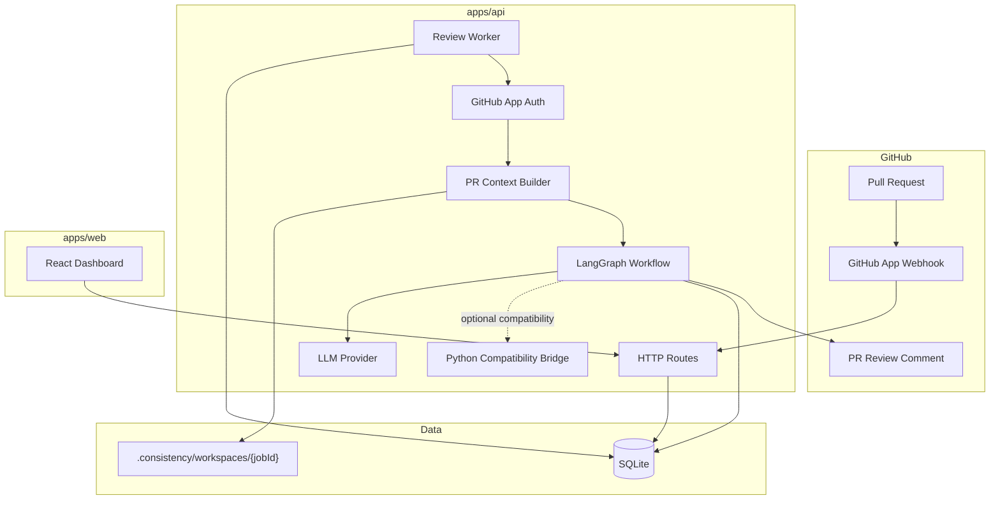

# Architecture

## System Overview

ConsistenCy uses TypeScript as the primary orchestration layer. Python remains available for compatibility analysis, but the canonical job, finding, agent-run, and report contracts live in `packages/schema`.

## Package Responsibilities

- `apps/api`: HTTP boundary, GitHub integration, SQLite persistence, worker, context construction, LangGraph nodes, providers, and comment publication.
- `apps/web`: operational dashboard consuming the shared API contracts.
- `packages/schema`: strict zod contracts shared by API, workflow, and Web UI.
- `backend`: retained Python analyzers, CLI, parsers, scoring, and evaluation support.

## Persistent Lifecycle

1. A signed webhook delivery is stored before or with job creation.
2. The worker atomically claims queued jobs and marks them running.
3. Every agent run is persisted with status, findings, error, and optional token usage.
4. The Synthesizer creates the canonical `ReviewReport`.
5. The report is persisted before comment publication.
6. A failed comment updates `github_comment_status=failed`; the job remains succeeded.
7. On startup, stale running jobs are re-queued for recovery.

## SQLite Tables

- `webhook_deliveries`: delivery idempotency and disposition.
- `jobs`: PR coordinates, lifecycle timestamps, status, and error.
- `agent_runs`: node-level audit trail and structured findings.
- `reports`: canonical report JSON and GitHub comment status.
- `schema_migrations`: ordered migration history.

## Trust Boundaries

- GitHub webhook input is untrusted until HMAC verification succeeds.
- Repository files are untrusted and only read inside the configured workspace.
- LLM output is untrusted until strict zod parsing succeeds.
- Browser management requests require a bearer token when configured, and production requires one.
- External comment publication is best-effort and cannot roll back a persisted report.
