# LangGraph Agent Design

## Graph

```mermaid
flowchart LR
  START --> LOAD["LoadPRContext"]
  LOAD --> PLAN["Planner"]
  PLAN --> SEC["Security"]
  SEC --> COR["Correctness"]
  COR --> MAINT["Maintainability"]
  MAINT --> TEST["Test"]
  TEST --> STYLE["Style"]
  STYLE --> SYN["Synthesizer"]
  SYN --> PERSIST["PersistReport"]
  PERSIST --> COMMENT["PublishGitHubComment"]
  COMMENT --> END
```

The first production version runs specialist nodes sequentially. Each node is isolated and uses shared state reducers, so independent branches can be parallelized later without changing report contracts.

## State

`ReviewGraphState` contains PR coordinates, context, plan, accumulated agent runs, findings, report, and non-fatal errors. Findings and agent runs use append reducers.

## Agent Responsibilities

- Planner: selects enabled agents and identifies risk areas.
- Security: authentication, webhook, secret, path, injection, token, and API boundary risks.
- Correctness: state transitions, exceptions, persistence, and external failure behavior.
- Maintainability: responsibility boundaries, shared schemas, duplication, and coupling.
- Test: specific missing tests and failure-path coverage.
- Style: naming, API response, file, and UI organization consistency.
- Synthesizer: deduplication, evidence downgrade, ordering, score, risk, and summary.

## Evidence Contract

- `confirmed`: file, start/end line, evidence, reasoning, and recommendation are mandatory.
- `likely`: file and evidence are mandatory; line range is optional but paired.
- `hypothesis`: uncertainty is mandatory and incomplete evidence cannot be promoted.
- Unknown keys are rejected by strict schemas.

Invalid provider output becomes a failed `AgentRun`; it does not crash the entire worker. The Synthesizer can still produce a report from surviving agent output.

## Providers

- `mock`: deterministic default for CI and Demo Mode.
- `deepseek`: reads only `DEEPSEEK_API_KEY` and optional base URL/model.
- `openai`: reads only `OPENAI_API_KEY` and model.

Provider outputs are parsed by zod. JSON repair is attempted once by the provider abstraction; repeated failure is recorded at agent level.

## Scoring

Reports start at 100. Confirmed findings reduce the score by severity; lower-confidence findings receive reduced or no primary deduction. The score maps to risk as follows:

- 0-39: critical
- 40-59: high
- 60-79: medium
- 80-100: low
