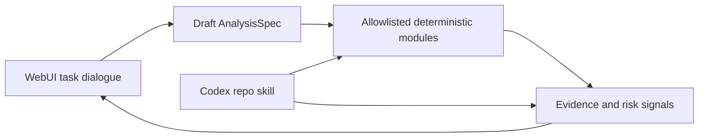

# LLM、确定性分析与 Codex 集成边界

ConsistenCy 把“理解任务”“执行分析”“交付结果”拆成三部分。三者共用证据和确定性引擎，但权限不同。



## 1. WebUI：LLM 对话与任务澄清

Repository Notebook 是默认的全页工作区。它支持 Markdown、GFM 表格和代码块，并把助手回答与引用证据一起展示。

当用户要求客制化分析时，Notebook 只生成待审核的 `AnalysisSpec` 草案，内容应包括：

- 目标和完成条件；
- 文件、语言和 SHA 范围；
- 从 `style`、`structural`、`semantic`、`duplication`、`security` 中选择的模块；
- 阈值、证据要求和正反例；
- 超时与输入预算。

LLM 不生成或执行临时 Python，也不能宣称草案已经运行。现阶段 UI 对话完成“理解任务 + 草案预览”；把草案确认后提交为新的分析 Job 是后续独立能力，不能用聊天文本隐式触发。

## 2. Python：允许列表中的确定性模块

Python 引擎是执行边界：模块必须在 registry 中注册，未知模块、解析错误或模块异常必须使请求显式失败，不能按 `score=0` 继续形成绿色报告。

“确定性”只表示相同版本、输入和配置可复现，并不表示发现一定是真实缺陷。当前结果适合审查优先级排序，仍需要人工验证。可信度分为：

| 层级 | 可以信任什么 | 不应推断什么 |
| --- | --- | --- |
| 协议 | 请求 ID、Schema、超时和结构化响应 | 分析规则一定正确 |
| 执行 | 内置模块不执行被审查代码；异常显式失败 | 已经达到 OS 沙箱隔离 |
| 证据 | 文件和行号可以复核 | 引用自动等于缺陷真值 |
| LLM | 解释和规划能力 | 模型输出可改写确定性分数 |

在开放第三方 Python 模块前，还需要每任务独立沙箱、无网络、只读输入、最小环境变量、资源限制、签名版本及 golden/metamorphic 测试。本项目因此明确禁止直接执行 LLM 生成的 Python。

## 3. Codex：在仓库中直接使用

仓库根目录的 `AGENTS.md` 告诉 Codex 运行时、架构边界和验证要求；`.agents/skills/consistency-review/` 提供可复用的只读审查技能与安全 CLI。打开本仓库后，可以要求 Codex 使用 `$consistency-review` 分析仓库内文件。

示例：

```text
Use $consistency-review to analyze engine/config.py and return the evidence-backed Markdown report.
```

该技能调用和 WebUI 相同的 Python 引擎，拒绝仓库外路径、secret/依赖/产物目录、二进制文件和超预算输入。它不会应用补丁，也不会执行被分析代码。

Codex 会读取仓库范围的 `AGENTS.md`，并发现 `.agents/skills` 中的技能，参见 [AGENTS.md](https://learn.chatgpt.com/docs/agent-configuration/agents-md) 与 [Agent Skills](https://learn.chatgpt.com/docs/build-skills)。

## WebUI 直接嵌入 Codex 的后续边界

如果后续要让 WebUI 对话由 Codex 驱动，应由 API 服务端接入 Codex SDK；浏览器只连接 ConsistenCy API。不要把 Codex 凭据、CLI 或 app-server 直接暴露给浏览器。深度客户端可以评估 app-server，但其 WebSocket 传输仍是实验能力，不应作为公开生产接口。参见 [Codex app-server](https://learn.chatgpt.com/docs/app-server) 与 [Codex MCP server](https://learn.chatgpt.com/docs/mcp-server)。

建议下一阶段增加一个最小 ConsistenCy MCP server，只暴露结构化只读工具：`analyze_public_pr`、`get_job_status`、`get_review_report`、`ask_repository_notebook`。发布评论或写入工作区必须保持独立工具并要求明确批准。
