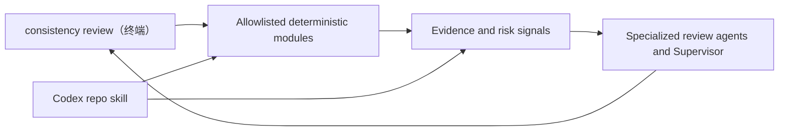

# LLM、确定性分析与 Codex 集成边界

ConsistenCy 把“理解任务”“执行分析”“交付结果”拆成三部分。三者共用证据和确定性引擎，但权限不同。


```mermaid
flowchart LR
  U["consistency review（终端）"] --> R["Allowlisted deterministic modules"]
  R --> E["Evidence and risk signals"]
  E --> M["Specialized review agents and Supervisor"]
  M --> U
  C["Codex repo skill"] --> R
  C --> E
```

## 1. 对话与任务澄清：Notebook API（仓库内没有前端）

`apps/api/src/notebook/` 是模型可见的问答 surface，带工具调用。Web 前端已随 v4 删除，仓库内没有随附界面，要使用它必须自行连接 HTTP API。

当用户要求客制化分析时，对话只应产出待确认的分析草案，内容应包括：

- 目标和完成条件；
- 文件、语言和 SHA 范围；
- 从 `style`、`structural`、`semantic`、`duplication`、`security` 中选择的模块；
- 阈值、证据要求和正反例；
- 超时与输入预算。

LLM 不生成或执行临时 Python，也不能宣称草案已经运行。草案确认后提交为新的分析 Job 是对话之外的显式动作，不能用聊天文本隐式触发。

## 2. Python：允许列表中的确定性模块

Python 引擎是执行边界：模块必须在 registry 中注册，未知模块、解析错误或模块异常必须使请求显式失败，不能按 `score=0` 继续形成绿色报告。

“确定性”只表示相同版本、输入和配置可复现，并不表示发现一定是真实缺陷。当前结果适合审查优先级排序，仍需要人工验证。可信度分为：

| 层级 | 可以信任什么 | 不应推断什么 |
| --- | --- | --- |
| 协议 | 请求 ID、Schema、超时和结构化响应 | 分析规则一定正确 |
| 执行 | 内置模块不执行被审查代码；异常显式失败 | 已经达到 OS 沙箱隔离 |
| 证据 | 文件和行号可以复核 | 引用自动等于缺陷真值 |
| LLM | 解释和规划能力 | 模型输出可改写确定性分数 |

在开放第三方 Python 模块前，还需要每任务独立沙箱、无网络、只读输入、最小环境变量、资源限制、签名版本及 golden/metamorphic 测试。本项目因此明确禁止直接执行 LLM 生成的 Python。

## 3. Codex：在仓库中直接使用

仓库根目录的 `AGENTS.md` 告诉 Codex 运行时、架构边界和验证要求；`.agents/skills/consistency-review/` 提供可复用的只读审查技能与安全 CLI。打开本仓库后，可以要求 Codex 使用 `$consistency-review` 分析仓库内文件。

示例：

```text
Use $consistency-review to analyze engine/config.py and return the evidence-backed Markdown report.
```

技能在仓库根目录下用 Python 3.12 直接运行（Windows 示例）：

```powershell
.\.venv\Scripts\python.exe --version
.\.venv\Scripts\python.exe .agents\skills\consistency-review\scripts\analyze_repo.py engine\runner.py
```

可以一次传多个仓库内路径。加 `--baseline-ref <ref>` 时，脚本用只读的 `git show` 读取该 ref 下的文件内容作为基线；在基线中不存在的文件只会给出低可信度的人工复核线索。该技能启用 `style`、`structural`、`semantic`、`duplication`、`security` 五个模块（不含 `evolution`）。

脚本的边界可以直接从 `.agents/skills/consistency-review/scripts/analyze_repo.py` 读到：只接受仓库内路径，拒绝逃逸出仓库的路径、secret 与生成目录（`.git`、`.venv`、`node_modules`、`dist`、`build`、`output` 等）以及超预算输入；只分析 `.py`、`.js`、`.jsx`、`.ts`、`.tsx`，单次最多 64 个文件、单文件 1,000,000 字节、总量 4,000,000 字节。它不会应用补丁，也不会执行被分析代码；非零退出或 `"ok": false` 必须当作分析失败，而不是干净结果。

### 终端入口：同一套审查也可以直接跑

不经过 Codex 时，终端入口是完整审查的正式路径：

```powershell
npm run consistency help
npm run consistency review -- --help
npm run consistency review -- --repo . --json
```

- `npm run consistency` 就是 `tsx apps/cli/src/main.ts`；命令只有 `review` 与 `help`，未知命令以退出码 2 结束。
- `npm run review` 等价于 `npm run consistency review`。
- 退出码是 CI 契约：0 = 跑完且没有 finding 达到阈值；1 = 跑完且有 finding 达到阈值；2 = 没跑成，或本次审查覆盖不完整。
- 一次 review 先用确定性引擎取证，再交给真实 LLM 的专项审查 agent 与 Supervisor 研判，最后由 `apps/cli/src/report.ts` 渲染成终端报告或 `--json`。终端与 HTTP daemon 复用 `createReviewRuntime`，不重复实现审查。

Codex 会读取仓库范围的 `AGENTS.md`，并发现 `.agents/skills` 中的技能，参见 [AGENTS.md](https://learn.chatgpt.com/docs/agent-configuration/agents-md) 与 [Agent Skills](https://learn.chatgpt.com/docs/build-skills)。

## 后续边界：如果重新引入 Web 客户端

当前仓库只提供终端入口与无界面的 HTTP daemon。如果将来重新引入 Web 客户端，应由 API 服务端接入 Codex SDK；浏览器只连接 ConsistenCy API。不要把 Codex 凭据、CLI 或 app-server 直接暴露给浏览器。深度客户端可以评估 app-server，但其 WebSocket 传输仍是实验能力，不应作为公开生产接口。参见 [Codex app-server](https://learn.chatgpt.com/docs/app-server) 与 [Codex MCP server](https://learn.chatgpt.com/docs/mcp-server)。

建议下一阶段增加一个最小 ConsistenCy MCP server，只暴露结构化只读工具（例如 `analyze_public_pr`、`get_job_status`、`get_review_report`、`ask_repository_notebook`）。发布评论或写入工作区必须保持独立工具并要求明确批准。
