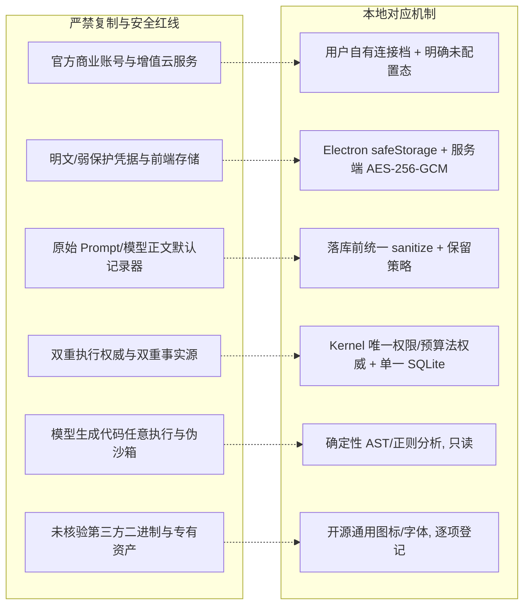

# ConsistenCy 上游开源复用来源账本（事实核验版）

**判定日期**：2026-09-27
**判定基线**：分支 `v3`，HEAD `0b20fa22388493c0616f9e032648743078be11aa` + 当日 dirty worktree（工作树含大量未提交改动；本文判定基于**工作树实际文件**，不基于提交内容）
**上一版**：2026-09-23（本文取代之。上一版第 7 节机器账本中的 `local_paths` 未做存在性核验，经本次逐一核对 **36/36 全部不存在**，见 §0.4）
**证据分层标注口径**：实现（源码存在）/ 接入（产品组合根或路由有真实调用点）/ 测试（存在并实际执行过的测试）/ 安装态实测（打包安装产物上的运行验证）
**本次审计执行环境**：Windows，24 逻辑核；Node **v25.8.1**（`.node-version`/`.nvmrc` 声明 Node 22；v3 时代的 `docs/delivery-readiness.md` 亦记录“系统 Node 25.8.1 不满足 engines”，该文件现为 v3 → v4 迁移记录）；Python venv 未参与本次判定
**本次证据来源**：仓库内文件 + 仓库外的 Codex 研究目录 `C:\Users\15857\Documents\Codex\2026-09-19\glm-coding-plan-23\harness-research\`（下称 `harness-research/`），其中 `evidence-index.md` 研究日期 2026-09-23，其第 3 行自述“本次未安装或运行上游”。**本次同样未安装、未运行任何上游项目**，因此不存在任何“上游源码级兼容性已验证”的判定基础。

> **一句话结论**：上一版账本把 14 条上游复用关系标成 `compatibility_verified: true` 并配上并不存在的本地路径；本次按仓库真实实现重判后，**没有任何条目达到“已验证”档**，最高档为“集成”，且多数“移植”声明实际是**本地原生实现（设计参考）**而非源码移植。

> **性质说明（v4 追加）**：本文是**特定时点的历史审计记录**（判定日期与判定基线见上），不是当前状态描述。文中出现的 `apps/web`、`apps/desktop`、Electron、Vite、Playwright 路径属于**当时**判定基线上的文件；这些前端与桌面组件已在 v4 删除。阅读时请把这些路径当作审计当时的证据，而不是现存能力。当前状态以 [delivery-readiness.md](delivery-readiness.md)（v3 → v4 迁移记录）与代码本身为准。

---

## 0. 判定口径（先读）

### 0.1 五档定义

| 档位 | 判定条件（全部满足） |
|---|---|
| **候选** | 已识别上游能力，但本地**没有**对位实现文件（能力缺口），仅保留调研结论 |
| **设计参考** | 本地有原生实现或本地契约，语义/测试思路与上游对位，但**没有**上游源码移植痕迹与归属声明；本地实现若无产品调用点，记为“设计参考（未接入）” |
| **移植** | 本地存在对位实现文件，且文件内可见派生于上游的内容与归属/许可声明，并有本地单元测试 |
| **集成** | 在“移植”或“设计参考”之上，**产品组合根/路由存在真实调用点**（`apps/api/src/server.ts`、`apps/api/src/http.ts`、`apps/web/src/shell/` 等），且随套件测试通过 |
| **已验证** | 集成 + 本次实际执行过的验证命令留下可复核证据 + **安装态实测**（H30/H31）通过 |

**本次判定上限**：本文所有条目最高为“集成”。原因：①上游从未在本机安装/运行，无法做源码级兼容性比对；②安装态实测（H31）本次未执行。任何“已验证”声明必须补上第 9 节的命令/输出/退出码格式才能生效。

### 0.2 证据分层表（每条判定的必填项）

| 层 | 判定问法 | 本轮可用的核验手段 |
|---|---|---|
| 实现 | 文件与符号是否存在？ | `Test-Path` + `grep` 符号名 |
| 接入 | 是否在产品路径被调用？ | `grep` 构造点（如 `new WorkflowRuntimeHost(`） |
| 测试 | 是否有测试且真的跑过？ | 本文 §9 的 6 次真实运行（`npx vitest run …`），命令、输出尾部、退出码齐全 |
| 安装态实测 | 打包产物上是否验证过？ | **未做**（H30/H31 属未完成项） |

### 0.3 三条硬规则

1. **不建空壳文件满足检查**：本轮未新增任何源码/测试/配置文件（写范围仅本文档）。
2. **不以“理论上可复用”冒充已实现**：只有 schema/类型而无调用点的，一律记“设计参考（未接入）”并附核对调用点的 grep 命令。
3. **路径必须实测存在**：下文所有本地锚点均已用 `Test-Path`/`grep` 核验；未核验的一律写“不存在”。

### 0.4 上一版 36 条 `local_paths` 存在性核验结论

核验命令（工作目录 = 仓库根，逐条 `Test-Path`）：

```powershell
$paths = @(
 'packages/harness-core/src/adapters/provider/config','packages/harness-core/src/adapters/provider/resolver.ts',
 'packages/harness-core/src/adapters/provider/__tests__/resolver.test.ts','apps/api/src/config/providerFacades.ts',
 'apps/api/src/config/__tests__/providerFacades.test.ts','apps/web/src/design-system/layout/sidePaneLayout.ts',
 'apps/web/src/design-system/layout/ResizablePanel.tsx','apps/web/src/design-system/layout/__tests__/sidePaneLayout.test.ts',
 'packages/workflow-compiler/src','packages/workflow-compiler/tests/compiler.test.ts',
 'packages/kernel/src/workflow/driverContracts.ts','packages/kernel/src/workflow/__tests__/driverContracts.test.ts',
 'apps/api/src/workflow-runtime/workerHarness.ts','apps/api/src/workflow-runtime/__tests__/workerHarness.test.ts',
 'apps/api/src/workflow-runtime/runService.ts','apps/api/src/workflow-runtime/__tests__/runService.test.ts',
 'packages/kernel/src/context/contextBuilder.ts','packages/kernel/src/context/compactPolicy.ts',
 'packages/kernel/src/context/__tests__/contextBuilder.test.ts','packages/schema/src/tracing.ts',
 'packages/harness-core/src/telemetry/errorSanitizer.ts','packages/harness-core/src/telemetry/__tests__/errorSanitizer.test.ts',
 'packages/schema/src/sessionEvents.ts','apps/api/src/session/projectionRegistry.ts',
 'apps/api/src/session/__tests__/projectionRegistry.test.ts','apps/api/src/jobs/checkpointBarrier.ts',
 'apps/api/src/jobs/__tests__/checkpointBarrier.test.ts','apps/api/src/config/settingsPolicy.ts',
 'apps/api/src/config/__tests__/settingsPolicy.test.ts','packages/harness-core/src/transport/jsonRpcLineTransport.ts',
 'packages/harness-core/src/transport/__tests__/jsonRpcLineTransport.test.ts','packages/plugins-builtin/src/mcp/mcpClient.ts',
 'packages/plugins-builtin/src/skills/skillsRegistry.ts','packages/plugins-builtin/src/mcp/__tests__/mcpClient.test.ts',
 'packages/kernel/src/scheduler/subagentLineage.ts','packages/kernel/src/scheduler/__tests__/subagentLineage.test.ts'
)
foreach ($p in $paths) { "{0,-7} {1}" -f $(if(Test-Path $p){'EXISTS'}else{'MISSING'}), $p }
```

结果：**36 条全部 MISSING**（含所有 `__tests__/*.test.ts` 契约测试路径）。相应地：

- 上一版 §7 中 `compatibility_verified: true` 的 **14** 条（Z01/Z02/Z03/Z05/Z06/Z07/Z08/Z09/D01/D02/D03/D04/D05/D06；Z04 原为 `false`）**全部作废**：它们指向的文件不存在。
- 上一版 §7 中 `upstream_tests_adapted`（如 `packages/provider/test/resolver.spec.ts`）**没有任何本地落地物**：本仓库无 `vendor/`、无 `adapters/upstream/`、无任何上游源码副本。
- 产品源码中**没有任何 SPDX 归属头、没有 “adapted from upstream” 声明、没有上游仓库 URL 引用**；唯一涉及上游名称的是 §1.3 的 `zcode-*` 命名空间（82 处）：

```powershell
# 必须排除 .venv/.zcode/.omo/staged/release 等打包运行时目录：
# 这些目录里 pip 自带大量 `SPDX-License-Identifier: Apache-2.0` 头，不排除会得到 123 处假命中
$src = Get-ChildItem -Recurse -File -Include *.ts,*.tsx,*.css,*.py |
       Where-Object { $_.FullName -notmatch '\\node_modules\\|\\.venv\\|\\.zcode\\|\\.omo\\|\\dist\\|\\staged\\|\\release\\|site-packages|\\__pycache__\\' }
$src | Select-String -Pattern 'SPDX-License-Identifier: Apache|adapted from upstream|zai-org|deepseek-ai/deepseek-harness'
# → 0 命中；上游名称命中仅来自 apps/web/src 的 zcode-* 命名空间（见 §1.3）
$src | Select-String -Pattern 'zcode' -CaseSensitive:$false      # → 82 处 / 4 文件，全部在 apps/web/src
```

---

## 1. 上游基准与许可证合规（保留有效信息 + 事实修正）

### 1.1 上游基准对象

| 属性 | ZCode | DeepSeek Harness（DSH） | 本地 ConsistenCy |
|---|---|---|---|
| 官方仓库 | [zai-org/ZCode](https://github.com/zai-org/ZCode) | [deepseek-ai/deepseek-harness](https://github.com/deepseek-ai/deepseek-harness) | [ConsistenCy](https://github.com/sk1ua/ConsistenCy) |
| 研究基准 Commit | `872ad960de7ec172591f7e1952f7849229f94521` | `00102833dfaee1da9f48a3a8eae9d34005a75218`（`dsh-v0.1.7-alpha.2`） | `0b20fa22388493c0616f9e032648743078be11aa`（`v3`） |
| 主许可证 | Apache-2.0（Copyright 2026 Z.AI Co., Ltd.） | MIT（Copyright 2026 DeepSeek） | MIT |
| 附随合规文件 | `NOTICE.md`、`THIRD-PARTY-NOTICES.md` | `THIRD_PARTY_NOTICES.md`、`SAFETY.md` | `LICENSE`、`NOTICE` |
| 运行依赖事实 | Node ≥24.14.0、Zod 4.6.5、workspace 私有包（`private: true`） | Node ^22.19 或 ≥24、`@deepseek-ai/cordis` 4.0.4 | Node 22.x、Python 3.12 |

**事实修正**：上游包均为 `private: true` 的 workspace 包，未在公共 npm 发行；`harness-research/evidence-index.md:19` 明确“当前没有一项被标为‘已经验证可直接装入本项目’”，且 `:3` 自述“本次未安装或运行上游”。**因此 A 档（依赖已有包）自本次起正式记为“无适用对象”，并且任何 `compatibility_verified: true` 都必须先有上机安装证据。**

### 1.2 若未来发生真实移植，必须满足的合规动作（保留）

- **Apache-2.0（ZCode）**：附许可全文；对被移植/改编文件加显式修改声明（§4b）；保留版权/专利/`NOTICE.md` 归属（§4c/4d）；**不得使用 Z.AI / ZCode 商标**（§6）；核实级联第三方依赖许可。
- **MIT（DSH）**：保留 2026 DeepSeek 版权与许可文本；核对 `THIRD_PARTY_NOTICES.md`；保留免责声明。
- **归属头模板**（仅当真的发生移植时使用，当前仓库**不存在**任何此类文件）：

```typescript
/**
 * SPDX-License-Identifier: Apache-2.0 OR MIT
 *
 * This file contains code adapted from upstream:
 * - Upstream Project: <ZCode | DeepSeek Harness>
 * - Repository: <https://github.com/zai-org/ZCode | https://github.com/deepseek-ai/deepseek-harness>
 * - Commit SHA: <872ad960… | 00102833…>
 * - Original Path: <upstream/file/path>
 * - Original Copyright: <Copyright 2026 Z.AI Co., Ltd. | Copyright 2026 DeepSeek>
 *
 * ConsistenCy Modifications:
 * - <逐条列出剥离与改写内容>
 */
```

### 1.3 本轮新发现的合规待办（Apache-2.0 §6 商标谨慎义务）

产品前端共有 **82 处** 以 `zcode` 为前缀/标识符的用法，分布在 4 个文件：

| 文件 | 处数 | 形态 |
|---|---|---|
| `apps/web/src/components/settings/ModelSettingsSection.tsx` | 41 | CSS 类命名空间 `zcode-model-panel`/`zcode-status-hero`/`zcode-provider-card`/`zcode-chip`… + 2 处注释 `{/* ZCode-Style Top Status Card */}`(`:282`)、`{/* ZCode Provider Card Grid */}`(`:309`) |
| `apps/web/src/styles/settings.css` | 35 | 对应的样式规则 |
| `apps/web/src/components/settings/ModelSettingsSection.test.tsx` | 4 | 选择器 `.zcode-provider-card` |
| `apps/web/src/styles/agent-desktop.css` | 2 | 相关规则 |

复核命令：

```powershell
Get-ChildItem -Recurse -File -Include *.ts,*.tsx,*.css,*.py -Path apps,packages,engine |
  Where-Object { $_.FullName -notmatch '\\node_modules\\|\\dist\\|\\staged\\|\\release\\' } |
  Select-String -Pattern 'zcode' -CaseSensitive:$false     # → 82 处 / 4 文件
```

判定与待办：

- 这 4 个文件**不含**上游源码副本（无所有权声明、无上游导出符号），因此**不触发** Apache-2.0 §4 的 NOTICE 义务；
- 但以 `ZCode` 作为代码命名空间与注释标识，落在 §6“许可证不授予商标权”的谨慎义务范围内；且本机从未获取上游源码，**无法核验这些 CSS 规则是否搬用自上游**（若确有搬用，则必须补 NOTICE 与来源声明）；
- **待办**：把 `zcode-*` 前缀改为中性命名（如 `provider-*`）、删除 2 处 `ZCode` 注释；若确认存在 CSS/组件搬用，则按 §1.2 补 `NOTICE` 与文件头声明。**本文档不修改产品代码，仅登记。**

---

## 2. 五档重判总表（Z01–Z09、D01–D06）

图例：**候选** = 未实现；**设计参考** = 本地原生对位实现；**设计参考（未接入）** = 有 schema/类型无调用点；**集成** = 有产品调用点 + 测试跑过。

| ID | 上游能力 | 上一版标注 | **本次判定** | 本地真实锚点（已核验） | 接入 | 测试 |
|---|---|---|---|---|---|---|
| Z01 | provider 配置解析 / 有效模型选择 / provenance | B（`compatibility_verified: true`） | **设计参考**（本地等价已集成） | `apps/api/src/config/effectiveSettings.ts:resolveEffectiveSettings,isSecretSetting,STANDARD_SETTING_DEFINITIONS`；`apps/api/src/config/env.ts`；`packages/schema/src/settings-flow.ts:effectiveSettingSourceSchema`；`apps/api/src/review/llm/profiles.ts:buildLlmProfileChain,computeLlmConfigRevision` | 有（`config/settings.ts:366` → `http.ts` 有效设置视图；`review/llm/factory.ts:106,111`） | 有（`effectiveSettings.test.ts`、`effectiveSettingsView.test.ts`、`profiles.test.ts`；含于 §9 R2） |
| Z02 | 只读配置投影 + 写入 Port + `expectedRevision` 乐观锁 | B（`true`） | **候选（未实现）** | 无。`expectedRevision` 全仓 0 命中；`providerFacades.ts` 不存在 | 无 | 无 |
| Z03 | 可折叠/可拖拽侧栏纯布局状态机 | B（`true`） | **设计参考**（本地等价已集成） | `apps/web/src/shell/useSidebarLayout.ts:parseSidebarLayout,SIDEBAR_LAYOUT_STORAGE_KEY`；`useWorkbenchLayout.ts`；`shell/AppShell.tsx`（`has-left-collapsed`/`has-right-collapsed`） | 有（AppShell 渲染） | 有（`useSidebarLayout.test.ts`、`AppShell.test.tsx`、`AppShellInteraction.test.tsx`） |
| Z04 | 动态工作流 TS 脚本编译器 / schema | B（`compatibility_verified: false`） | **候选（未实现）** | 无。`from "typescript"`、`compileWorkflowScript`、`analyzeWorkflowScript` 全仓 0 命中；本地只有 JSON DAG 编译器 `apps/api/src/workflow-runtime/compile.ts:compileWorkflowRuntimeDefinition` | 无（脚本模式不存在） | 无 |
| Z05 | `WorkflowDriver`/`JournalStorePort`/capabilities/`inputHash` 重放 | B（`true`） | **设计参考**（本地运行时有接入，非完整等价：审批决定无法续跑） | `apps/api/src/workflow-runtime/registry.ts:WorkflowNodeRegistry,workflowNodeRegistry,getWorkflowNodeService`；`host.ts:WorkflowRuntimeHost`；`executor.ts`；`store.ts:WorkflowRuntimeStore`；`definition.ts`；指纹：`packages/kernel/src/evidence/fingerprint.ts` | 有（`server.ts:189`） | 有（`registry.test.ts`、`host.test.ts`、`executor.test.ts` 等） |
| Z06 | 脚本 worker 进程生命周期 / 取消 / settlement | C（`true`） | **候选（未实现）** | 无。产品代码中无 `node:vm`；`node:worker_threads` 仅出现在测试与测试夹具（`apps/api/src/publish/walConcurrency.test.ts`、`publish/fixtures/walClaimWorker.ts`） | 无 | 无 |
| Z07 | 生产 run service / 恢复 / journal 订阅 | C（`true`） | **设计参考**（恢复限 H14 中断运行；审批等待无恢复通路） | `apps/api/src/workflow-runtime/host.ts`（`executeRecovery`、`refuseRecovery`、checkpoint 折叠）；`registry.ts`；`triggers.ts` | 有（`server.ts:189`） | 有（`recovery.test.ts`、`bindings.test.ts`、`triggers.test.ts`） |
| Z08 | 上下文分段 / Token 预算 / compact 压缩 / 会话恢复状态机 | B（`true`） | **设计参考**（已集成）+ **候选（compact 未实现）** | 有：`packages/kernel/src/context/manager.ts`（ContextManager，注释明示“no automatic eviction policy, no summarization”）、`image.ts`、`page-store.ts`、`working-set.ts`、`checkpoint.ts`；`apps/api/src/review/context/buildLocalContext.ts`、`contextRouter.ts:createContextBuilder`；预算：`packages/workload-review/src/workload/review-workload.ts:tokenBudget` | 有（`server.ts:308` contextBuilder） | 有（`packages/kernel/src/__tests__/context-*.test.ts`、`review/context/buildLocalContext.test.ts`） |
| Z09a | 错误安全分类 / 脱敏 | B（`true`） | **设计参考**（本地等价已集成） | `apps/api/src/security/redact.ts:redactSensitiveText,sanitizeStructuredData,sanitizeExecutionError,sanitizePublicError,containsSensitiveData`；`packages/workload-review/src/context/content-policy.ts:redactModelVisibleText`；`packages/plugins-builtin/src/analyzer/redact.ts` | 有（`server.ts:29`、`http.ts:184`、多处 store） | 有（`security/redact.test.ts`、`content-policy.test.ts`） |
| Z09b | 遥测 tracing 契约（`packages/schema/src/tracing.ts`） | B（`true`） | **设计参考**（本地等价已集成，路径不同） | `packages/schema/src/runtime.ts:executionTraceContextSchema,runExecutionTraceSchema,stepExecutionTraceSchema,attemptExecutionTraceSchema`；`apps/api/src/diagnostics/traceView.ts:buildRunTraceView` | 有（`diagnostics/service.ts:36`） | 有（`packages/schema/src/runtime.test.ts`、`diagnostics.test.ts`） |
| D01 | 追加式事件流 → 纯投影 → UI 读模型 | B（`true`） | **集成** | `apps/api/src/workflow-runtime/eventStore.ts:WorkflowRuntimeEventStore,EVENT_LIFECYCLE`；`packages/schema/src/workflow-runtime.ts:projectWorkflowRunTimeline,mergeWorkflowRunEvents`；`apps/web/src/components/runtime/runEventTimeline.ts:fetchRunEventTimeline,runEventCursor` | 有（`server.ts:71`；`RuntimePanel`） | 有（`eventStore.test.ts`、`packages/schema/src/workflowRuntimeTimeline.test.ts`、`RuntimePanel.test.tsx`） |
| D02 | 检查点安全屏障：调用前 flush、失败 fail-closed、未知结果不重放 | B（`true`） | **设计参考（本地已接入，非上游移植）**；R1 修复证据见 §3.11；审批等待不续跑、无安装态实测，非“已验证” | `apps/api/src/workflow-runtime/checkpointStore.ts:WorkflowRuntimeCheckpointStore`；`host.ts`（`outcome_unknown`、`step_outcome_unknown`、`refuseRecovery`） | 有（`server.ts:74`） | 有（`stepFactDurability.test.ts`、`checkpointIntegrity.test.ts`、`recovery.test.ts`） |
| D03a | schema 级 secret 标注 / 脱敏 / secret presence | B（`true`） | **设计参考**（本地等价已集成） | `apps/api/src/config/settings.ts:SettingsStore,toRendererSettings,isSecretSettingKey`（AES-256-GCM，`:227,:238`）；`config/effectiveSettings.ts:isSecretSetting`；`packages/schema/src/settings-flow.ts:effectiveSettingItemViewSchema`；桌面 `apps/desktop/src/main.cjs:274-314`（`safeStorage`） | 有（`server.ts`、`http.ts` 设置路由） | 有（`settings.test.ts`、`effectiveSettings.test.ts`、`useSettingsForm.test.ts`） |
| D03b | `expectedRevision` 乐观锁防脏写 | B（`true`） | **候选（未实现）** | 无。`expectedRevision` 全仓 0 命中；`SettingsStore.update(input: unknown): SettingsSnapshot` 无任何版本前置条件 | 无 | 无 |
| D04 | 行式 JSON-RPC 传输（`JsonRpcLineTransport`） | B（`true`） | **设计参考**（功能等价物存在，非 JSON-RPC） | `apps/api/src/review/deterministic.ts:DeterministicAnalyzer,ManagedProcess,MAX_STDOUT_LINE_BYTES,parseTimeoutMs`（JSON-over-stdio、换行分帧、进程 kill/respawn、超时） | 有（`server.ts:149`） | 有（`review/deterministic.test.ts`，含真实 Python 引擎 stdio 用例） |
| D05 | MCP 客户端 + Skills 注册表 | C（`true`） | **候选（未实现）** | 无。全仓源码（含 `.cjs`、`.py`）中 `mcp`/`MCP` **0 命中**；`skills` 在 TS 源码中 0 命中（仓库仅有 `.agents/skills/consistency-review/`，属 Codex 侧技能，不是产品实现） | 无 | 无 |
| D06 | 子任务树状 lineage / result·cancel·dispose 所有权 | C（`true`） | **设计参考**（本地等价已集成） | `packages/kernel/src/agent/registry.ts:AgentRegistry`（`AgentTreeInvariantError`、`parent`/`children`、跨 Run 父链校验）；`agent/types.ts:parent,children`；`scheduler/scheduler.ts`（`parent_cancelled`）；`scheduler/cancellation.ts:createCancelCause` | 有（`scheduler.ts:80`、`scheduler.ts:188`） | 有（`packages/kernel/src/__tests__/agent-registry.test.ts`、`cancellation.test.ts`、`scheduler.test.ts`） |

**条目计数**（表内共 17 行，Z09 与 D03 拆为子项）：

| 档位 | 条数 | 条目 |
|---|---|---|
| 候选 | **5** | Z02、Z04、Z06、D03b、D05（另 Z08 的 compact 压缩子项亦为候选） |
| 设计参考 | **11** | Z01、Z03、Z05、Z07、Z08、Z09a、Z09b、D02、D03a、D04、D06（本地接入不等于全部语义完成） |
| 移植 | **0** | 无（仓库内不存在任何上游派生文件与归属声明） |
| 集成 | **1** | D01 |
| 已验证 | **0** | 无（缺安装态实测层） |

> 复核用 grep 命令（可直接粘贴执行，工作目录 = 仓库根）。**必须排除构建/打包产物**（`dist/`、`staged/`、`release/`、`.zcode/`）：它们内含 undici 等打包依赖，会对 `If-Match`、`mcp` 等词产生大量假命中（本次实测：不排除时 `If-Match` 9 处、`mcp|MCP` 391 处，全部来自 `apps/api/dist/server.cjs` 及其打包副本）。
>
> ```powershell
> $src = Get-ChildItem -Recurse -File -Include *.ts,*.tsx,*.cjs,*.mjs,*.py |
>        Where-Object { $_.FullName -notmatch '\\node_modules\\|\\.consistency\\|\\.omo\\|\\dist\\|\\staged\\|\\release\\|\\.zcode\\|site-packages|\\__pycache__\\' }
> # $src 计数 = 679 个源码文件
> # Z02 / D03b：乐观锁协议是否存在                          → 0 命中
> $src | Select-String -Pattern 'expectedRevision|If-Match|revisionConflict'
> # Z04：TS 脚本编译器是否存在                              → 0 命中
> $src | Select-String -Pattern 'from "typescript"|compileWorkflowScript|analyzeWorkflowScript'
> # Z06：脚本沙箱 / worker 宿主是否存在                      → 仅 2 处测试夹具命中，产品代码 0 命中
> $src | Select-String -Pattern 'node:vm|worker_threads'
> #   apps/api/src/publish/fixtures/walClaimWorker.ts:1
> #   apps/api/src/publish/walConcurrency.test.ts:3
> # D05：MCP / Skills 是否存在                              → 0 命中
> $src | Select-String -Pattern 'mcp|MCP'
> # Z05 / D03 / D04 / D06：上一版声称的符号是否存在          → 0 命中
> $src | Select-String -Pattern 'inputHash|JournalStore|WorkflowDriver|JsonRpcLineTransport|subagentLineage|SkillsRegistry'
> ```

---

## 3. ZCode 复用关系逐条结论

### 3.1 Z01 provider 配置与有效模型选择 → **设计参考（本地等价已集成）**

上游提供分层配置合并 + 有效模型选择 + provenance。本地有功能对位且已接入的实现：`resolveEffectiveSettings`（`source: env|file|default`、`lockedByEnv`、`restartRequired`，由 `config/settings.ts:366` 调用）、`buildLlmProfileChain`/`computeLlmConfigRevision`（`review/llm/factory.ts:106` 调用）。**不存在** `packages/harness-core/src/adapters/provider/**`，也没有任何适配自上游的文件头，因此这不是“移植”，而是本地原生实现。上一版的“Downgraded Zod schemas …”“Connected credentials resolution to SecretRef port”属未发生的描述。

### 3.2 Z02 provider facades + `expectedRevision` 乐观锁 → **候选（未实现）**

`facades.ts` 的对位能力（读投影 + 写入 Port + 版本冲突检测）在本仓库**完全缺失**：无 `providerFacades.ts`，`expectedRevision` 全仓 0 命中，设置写入 `SettingsStore.update(input: unknown)` 没有任何 revision 前置条件。这是**真实能力缺口**，不应以“已移植”记入账本。原 H09 中“expectedRevision 防脏写”的准入标准**未达成**。

### 3.3 Z03 侧栏折叠/拖拽布局 → **设计参考（本地等价已集成）**

本地实现：`useSidebarLayout.ts`（版本化 localStorage 持久化、宽度 clamp、`<980px` 门控）、`useWorkbenchLayout.ts`、`AppShell.tsx`（左右栏独立折叠、键盘 Alt+[ / Alt+]、焦点迁移）。测试：`useSidebarLayout.test.ts`、`AppShell.test.tsx`、`AppShellInteraction.test.tsx`。不存在 `apps/web/src/design-system/layout/**`。无上游源码移植证据。

### 3.4 Z04 动态工作流编译器（TS 脚本） → **候选（未实现）**

`packages/workflow-compiler` 不存在；`from "typescript"`、`compileWorkflowScript`、`analyzeWorkflowScript` 全仓 0 命中。本地工作流定义是**类型化 JSON DAG**（`packages/schema/src/workflow-runtime.ts` + `apps/api/src/workflow-runtime/compile.ts:compileWorkflowRuntimeDefinition` + `validate.ts`）。脚本编排模式**没有落地**。

### 3.5 Z05 工作流引擎驱动契约 → **设计参考（本地等价已集成）**

本地有完整对位实现并接入产品：节点注册表（`WorkflowNodeRegistry`，注册期 fail-closed 校验 capability 是否已注册 syscall）、执行器（`executor.ts`，逐节点 fail-closed）、宿主（`WorkflowRuntimeHost`）、持久 run/definition store、快照指纹。上一版声称的 `WorkflowDriver`/`JournalStorePort`/`inputHash` 符号**在本仓库不存在**（grep 0 命中），因此不构成移植。H11/H14 的“单一事实源”原则由 `packages/kernel` AuditJournal + SQLite 承担，未见双重事实源。

### 3.6 Z06 脚本 worker 进程宿主 → **候选（未实现）**

产品代码无 `node:vm`；`worker_threads` 仅用于测试夹具。因此没有“脚本 worker 的取消/超时/settlement 桥接”可复用结论。相关安全红线（§7.5“不把 Node VM 当沙箱”）**依然有效**，且当前不需要豁免，因为该能力未引入。

### 3.7 Z07 生产 run service / 恢复 / journal → **设计参考（本地等价已集成）**

`WorkflowRuntimeHost` 提供恢复入口与拒绝语义（`refuseRecovery`：定义校验失败、HEAD 漂移、UNKNOWN 副作用分别阻断 continue）。上一版 `apps/api/src/workflow-runtime/runService.ts` 不存在。**H14 现有限制照实记录**：当前实现显式拒绝 HEAD 漂移后的 continue（`definition_checksum_changed` / `head_changed` 阻断），这是安全改进，但**不等于**“已支持固定历史快照下的恢复”。

### 3.8 Z08 上下文装配 / 压缩 → **设计参考（已集成）+ 候选（compact 未实现）**

本地 ContextManager 的核心注释明确“no automatic eviction policy, no summarization, no retrieval, no embedding scoring”——即**上下文分段与显式 residency 有实现，摘要/compact 压缩策略没有实现**。`packages/kernel/src/context/compactPolicy.ts` 不存在；`compact` 关键字在全仓源码仅命中 CSS/响应式测试等无关位置。Token 预算只存在于评审工作负载（`REVIEW_AGENT_TOKEN_BUDGET`）。旧账本对 Z08 的 `compatibility_verified: true` 与两个不存在的路径同样作废。

### 3.9 Z09a 错误分类与脱敏 → **设计参考（本地等价已集成）**

本地脱敏体系：字符串/结构化/路径三类清洗（`redactSensitiveText`、`sanitizeStructuredData`、`sanitizeExecutionError`、`containsSensitiveData`），模型可见文本策略（`redactModelVisibleText`，含私钥块、URL 凭据、token 模式），分析器摘录脱敏（`plugins-builtin/src/analyzer/redact.ts`）。**“默认不落盘原始正文”的红线已由多条代码路径强制执行**（eventStore/notices/sink/diagnostics 在写库前统一 sanitize）。测试齐全并随 §9 套件通过。

### 3.10 Z09b 遥测 tracing 契约 → **设计参考（本地等价已集成，路径与旧账本不同）**

旧账本指向的 `packages/schema/src/tracing.ts`、`packages/harness-core/src/telemetry/errorSanitizer.ts` **不存在**；真实实现在 `packages/schema/src/runtime.ts`（`executionTraceContextSchema` / `run|step|attemptExecutionTraceSchema`）+ `apps/api/src/diagnostics/traceView.ts`（纯聚合、未知项写进 `unknowns`、不伪造 0）。判定为“设计参考”而非“移植”，理由同 §3.1（无上游派生证据）。

### 3.11 D02 关联的 R1 修复复判（保留原审计时间线）

Wave 3 原审查（`consistency/wave3-runtime-review-2026-09-26.md` R1）指出：`host.ts` 的 `onStepEvent` 对 `recordEvent` 失败直接 catch、checkpoint 写失败亦 catch，executor 仍继续发出模型请求。这是**修复前**的事实；原审计时 `stepFactDurability.test.ts` 尚未纳入其测试计数。

本轮工作树复判：`executor.ts` 在调用 provider/tool 前 await 必需的 `step_started`，写失败停止派发；`host.ts` 对必需事件和可复用结果写入的失败不再作为纯观测吞掉，未知已派发结果阻断盲目重放。Node v22.23.2 / Python 3.12.10 下本轮全量 `npm test` 退出码 0：API **104 文件 / 1043 用例通过**，含 `stepFactDurability.test.ts` 7 项、`checkpointIntegrity.test.ts` 14 项、`recovery.test.ts` 11 项、`approval.test.ts` 6 项。付费检查点缺少事件 seq、成功事实或更早派发意图，或存在更晚未结算派发时，均不能授权重放。H14 `continue` 在创建后继前原子消耗一次性恢复声明。H18 批准在定义仍可执行后领取同一次运行的续跑；拒绝零派发，重复决定与崩溃后的已领取声明不能再次计费。D02 仍是**本地设计参考且部分接入**：无上游源码移植证明、无安装态真实 LLM 实测，**不得**称“移植”或“已验证”。

---

## 4. DSH 复用关系逐条结论

### 4.1 D01 事件流 + 纯投影 → **集成**（本文最高档）

- 事实源：`WorkflowRuntimeEventStore`（append-only、`seq` 每 run 单调、`UNIQUE(run_id, seq)`、写事件与 run 状态变更同事务、落库前 sanitize）。
- 投影：`packages/schema/src/workflow-runtime.ts:projectWorkflowRunTimeline`（纯函数，前后端共用）+ `mergeWorkflowRunEvents`（eventId 去重、游标续传）。
- 客户端：`runEventTimeline.ts`（有界分页 8×200、断线重取、不从 socket 关闭推断终态）。
- 接入与测试：`server.ts:71`；`eventStore.test.ts`、`workflowRuntimeTimeline.test.ts`、`RuntimePanel.test.tsx`，均随 §9 R2/R3/R4 通过。
- 仍未达成“已验证”：无安装态实测。原审计提出的 R3 终态映射缺口已由共享 `projectRunTerminal` 和 `runTerminalFidelity.test.ts` / `traceViewTerminalFidelity.test.ts` 回归覆盖；这些是工作树复判，不应倒填原审计日期的结论。

### 4.2 D02 检查点屏障 → **设计参考（本地部分接入，非移植）**，复判见 §3.11

### 4.3 D03a 秘密标注与脱敏 → **设计参考（本地等价已集成）**

`isSecretSetting`/`effectiveSettingItemViewSchema` 保证秘密字段只回传 `configured` 存在性；服务端凭据 AES-256-GCM（`settings.ts:227,238`）；桌面凭据经 Electron `safeStorage`（`apps/desktop/src/main.cjs:274-314`，含 `isEncryptionAvailable()` 门控与明文只经环境变量传给 API 子进程）。旧账本 `apps/api/src/config/settingsPolicy.ts` 不存在。

### 4.4 D03b `expectedRevision` 乐观锁 → **候选（未实现）**，详见 §3.2

### 4.5 D04 行式 JSON 传输 → **设计参考（等价物存在，但不是 JSON-RPC）**

`DeterministicAnalyzer` 用换行分帧的 JSON-over-stdio 与 Python 引擎通信，具备进程代数管理（kill → 等待 `close` → 允许 respawn）、stdout 行长上限、stderr 尾部截断、超时解析与协议违规致命化。**缺失**：JSON-RPC 方法/通知语义、pending 请求 id 映射、版本协商。旧账本 `JsonRpcLineTransport` 类不存在。

### 4.6 D05 MCP 与 Skills → **候选（未实现）**

全仓 `mcp`/`MCP` 0 命中（含 `.cjs`、`.py`；仅 docs 提到未来建议）。产品中无 MCP 客户端、无 Skills 注册表。**注意**：这与本仓库存在 `.agents/skills/consistency-review/`（Codex 侧技能）不冲突——后者不是产品运行时实现。

### 4.7 D06 子任务 lineage → **设计参考（本地等价已集成）**

`AgentRegistry` 强制父子不变式（同 Run、无自父、无环、深度上限、`children` 双向一致），`scheduler.ts` 支持 `parent_cancelled` 级联取消且不反转终态。**没有** DSH 的 `subagent` 包对应物，也没有子进程旁路模型的实现，符合“单一调度权威”红线。

---

## 5. “假 verified → 降级”清单（本次核心更正）

| # | 旧条目 | 旧标注 | 降级为 | 触发原因（可复核） |
|---|---|---|---|---|
| 1 | Z01 `packages/harness-core/src/adapters/provider/**` | adapted-source, B, `true` | **设计参考** | 路径不存在；真实实现是 `apps/api/src/config/effectiveSettings.ts` |
| 2 | Z02 `apps/api/src/config/providerFacades.ts` + `expectedRevision` | adapted-source, B, `true` | **候选（未实现）** | 路径不存在；`expectedRevision` 全仓 0 命中 |
| 3 | Z03 `apps/web/src/design-system/layout/sidePaneLayout.ts`/`ResizablePanel.tsx` | adapted-source, B, `true` | **设计参考** | 路径不存在；真实实现是 `apps/web/src/shell/useSidebarLayout.ts` |
| 4 | Z05 `packages/kernel/src/workflow/driverContracts.ts` | adapted-source, B, `true` | **设计参考** | 路径不存在；`WorkflowDriver`/`JournalStorePort`/`inputHash` 0 命中 |
| 5 | Z06 `apps/api/src/workflow-runtime/workerHarness.ts` | design-reference, C, `true` | **候选（未实现）** | 路径不存在；产品无 `node:vm`/worker 宿主 |
| 6 | Z07 `apps/api/src/workflow-runtime/runService.ts` | design-reference, C, `true` | **设计参考** | 路径不存在；真实实现是 `host.ts` + `registry.ts` |
| 7 | Z08 `packages/kernel/src/context/contextBuilder.ts`/`compactPolicy.ts` | adapted-source, B, `true` | **设计参考 + 候选（compact）** | 两路径均不存在；ContextManager 注释明示不做摘要 |
| 8 | Z09 `packages/schema/src/tracing.ts`/`harness-core/.../errorSanitizer.ts` | adapted-source, B, `true` | **设计参考**（Z09a/Z09b） | 两路径均不存在；真实实现在 `security/redact.ts` 与 `schema/runtime.ts` |
| 9 | D01 `packages/schema/src/sessionEvents.ts`/`apps/api/src/session/projectionRegistry.ts` | adapted-source, B, `true` | **集成**（路径更正） | 两路径均不存在；真实实现在 `workflow-runtime/eventStore.ts` 与 `schema/workflow-runtime.ts` |
| 10 | D02 `apps/api/src/jobs/checkpointBarrier.ts` | adapted-source, B, `true` | **设计参考（本地部分接入，非移植；§3.11 复判）** | 旧路径不存在；现有屏障位于 `workflow-runtime/executor.ts` / `host.ts` / `checkpointStore.ts`；审批续跑缺失，无安装态证明 |
| 11 | D03 `apps/api/src/config/settingsPolicy.ts` | adapted-source, B, `true` | **设计参考 + 候选（revision）** | 路径不存在；乐观锁未实现 |
| 12 | D04 `packages/harness-core/src/transport/jsonRpcLineTransport.ts` | adapted-source, B, `true` | **设计参考** | 路径不存在；等价物是 `review/deterministic.ts`，非 JSON-RPC |
| 13 | D05 `packages/plugins-builtin/src/mcp/mcpClient.ts`/`skills/skillsRegistry.ts` | design-reference, C, `true` | **候选（未实现）** | 路径不存在；`mcp` 全仓 0 命中 |
| 14 | D06 `packages/kernel/src/scheduler/subagentLineage.ts` | design-reference, C, `true` | **设计参考** | 路径不存在；等价物是 `kernel/src/agent/registry.ts` |
| 15 | 全表 `upstream_tests_adapted`（12 条上游 spec 路径） | 声称已移植 | **不存在** | 仓库内无任何上游测试副本；旧账本列出的上游 spec 也未在本机获取 |

---

## 6. 实验路径与产品路径分列

### 6.1 产品路径（`apps/`、`packages/`、`engine/`）——本账本的判定对象

| 能力 | 产品文件（已核验存在） |
|---|---|
| 事件库 / 投影 | `apps/api/src/workflow-runtime/eventStore.ts`、`packages/schema/src/workflow-runtime.ts`、`apps/web/src/components/runtime/runEventTimeline.ts` |
| 检查点 / 恢复 | `apps/api/src/workflow-runtime/checkpointStore.ts`、`host.ts` |
| 节点注册 / 执行 | `apps/api/src/workflow-runtime/registry.ts`、`executor.ts`、`validate.ts`、`compile.ts` |
| 设置与有效配置 | `apps/api/src/config/settings.ts`、`effectiveSettings.ts`、`effectiveSettingsView.ts`、`packages/schema/src/settings-flow.ts` |
| LLM 连接档 / 路由 / 错误分类 | `apps/api/src/review/llm/profiles.ts`、`routing.ts`、`errors.ts`、`factory.ts`、`piProvider.ts` |
| 脱敏 | `apps/api/src/security/redact.ts`、`packages/workload-review/src/context/content-policy.ts` |
| tracing 视图 | `apps/api/src/diagnostics/traceView.ts`、`service.ts`、`retention.ts` |
| 取消 / lineage | `packages/kernel/src/scheduler/cancellation.ts`、`scheduler.ts`、`agent/registry.ts` |
| 确定性引擎通道 | `apps/api/src/review/deterministic.ts`、`engine/`（Python，JSON-over-stdio） |
| 桌面凭据 | `apps/desktop/src/main.cjs`、`device-flow.cjs` |

### 6.2 实验/探针路径（不进产品判定）

| 路径 | 性质 | 说明 |
|---|---|---|
| `packages/workflow-compiler/` | **不存在** | 上一版声称的 Z04 隔离实验目录从未落地 |
| `apps/api/src/publish/fixtures/walClaimWorker.ts` + `walConcurrency.test.ts` | 测试专用 worker 夹具 | 仅测试路径使用 `worker_threads`，非产品能力 |
| `tests/fixtures/mock_engine` | Python 引擎探针 | 供 `deterministic.test.ts` 注入协议违规/挂死场景 |
| `.omo/evidence/**` | 交付证据快照（非源码） | 含历史 `npm-test.log`；**未找到超时失败现场日志**（见 §9.2） |
| `.consistency/workspaces/job_*` | 运行时克隆产物 | vitest 已在 `apps/api/vitest.config.ts` 与根 `vitest.config.ts` 中排除 |
| `apps/desktop/release|staged`、`.zcode/`、`.venv/` | 打包/本地运行时 | 不参与复用判定 |

---

## 7. 严格禁止复制清单（保留，措辞按当前事实校准）

以下上游实现**禁止复制**；右侧为 ConsistenCy 现有对应机制（均已核验存在）：



1. **商业账号/增值服务**：不引入上游 OAuth 账号绑定、订阅计费、官方网关与额度刷新；本地只支持用户自配置连接档，额度未知就写 `usageUnknown`，禁止伪造。
2. **不安全凭据存储**：不引入环境派生弱密钥、CLI 明文 token、浏览器 localStorage 存凭据、未鉴权远程凭据同步。桌面用 `safeStorage`（`apps/desktop/src/main.cjs`），服务端用 AES-256-GCM（`apps/api/src/config/settings.ts`），DTO 只回传 `SecretRef`/存在性。
3. **原始正文默认落盘**：不引入上游默认记录完整 prompt/仓库正文/模型输出的 telemetry。本地在写库前统一 `sanitizeStructuredData`（`eventStore.ts`、`completion/*`、`diagnostics/service.ts`），原始文本仅显式诊断且脱敏。
4. **双重权威/双重事实源**：不同时常驻两套 agent loop；不让工作流引擎绕过 Kernel 直接发起系统调用；不在 SQLite 之外维护第二套会话状态。
5. **任意代码执行与伪沙箱**：不引入 `workflow-ptc` 整包默认启用，不把 Node `vm` 称安全沙箱。当前本地**没有**脚本执行能力（Z04/Z06 未实现），该红线无需豁免；将来引入必须默认关闭并置于 OS 级沙箱。
6. **未核验第三方资产**：不搬运 ZCode 的预编译二进制、商业字体与专有图标；UI 使用开源通用资源。

---

## 8. 任务闭环矩阵（H00–H31，复用策略列已按新判定校准）

“上游关系”列 = 本次判定；“本地证据”列 = 是否存在可复核锚点（无 = 尚未实现）。

| 任务 | 目标 | 上游关系（新） | 本地证据 |
|---|---|---|---|
| H00 | 锁定基线与改动归属 | — | 本文 §0 已登记基线 |
| H01 | 大范围 Diff、跨页搜索与返回 | Z03 设计参考 | `apps/web/src/pages/ReportPage.tsx` 等（本审计未逐页复核功能，仅登记） |
| H02 | 报告语义与摘要单一来源 | Z09 设计参考（脱敏/观测语义） | `apps/web/src/pages/ReportPage.test.tsx`（§9.6 显示断言被增强） |
| H03 | Shell/侧栏/组件系统收敛 | Z03 设计参考 | `apps/web/src/shell/useSidebarLayout.ts`、`AppShell.tsx` |
| H04 | GitHub 身份与功能状态一致 | — | `apps/api/src/github/*`（本轮未审计） |
| H05 | 修正文档矛盾与能力状态协议 | — | `docs/capability-matrix.md`（本轮未审计） |
| H06a/b/c | 上游复用实验与来源账本 | 全部 | **实验未落地**；本文即为 H06 的账本产出（并更正值） |
| H07 | 有效配置与配置修订协议 | Z01/D03 设计参考 | `config/effectiveSettings.ts`、`packages/schema/src/settings-flow.ts`；**修订协议（revision）无** |
| H08 | 连接档、路由与故障转移 | Z01 设计参考 | `review/llm/profiles.ts`、`routing.ts`、`errors.ts` |
| H09 | 设置完整用户流程 | Z02/D03：**revision 未实现** | 表单与来源徽章齐备；`expectedRevision` 缺席 |
| H10 | Session/Run/Step/Attempt 合约 | D01 集成 | `packages/schema/src/runtime.ts`、`workflow-runtime.ts` |
| H11 | 持久事件、artifact 与事务 | D01 集成 | `workflow-runtime/eventStore.ts`（事务耦合、单调 seq） |
| H12 | 事件投影、续传与时间线 | D01 集成 | `projectWorkflowRunTimeline`、`runEventTimeline.ts` |
| H13 | 取消树与预算统一管理 | D06/Z05 设计参考 | `kernel/src/scheduler/cancellation.ts`、`budget/accounting.ts` |
| H14 | 检查点与重启恢复 | D02 本地设计参考部分接入（中断运行续跑，审批等待不可续跑）；R1 修复复判见 §3.11 | `checkpointStore.ts`、`host.ts`；HEAD 漂移即为阻断（见 §3.7） |
| H15 | 完成事件与监督端回报 | D01 派生 | `apps/api/src/completion/{notices,sink,store}.ts` |
| H16 | 节点注册协议与范围配额 | Z04/Z05 ：**Z04 未实现**，注册表已实现 | `workflow-runtime/registry.ts`、`selection.ts`（十文件配额披露） |
| H17 | 模型与只读工具节点 | Z05 设计参考 | `workflow-runtime/modelBackend.ts`、`executor.ts`（模型节点 + 只读文件上下文工具） |
| H18 | 条件、人工等待与有界并发 | Z05 设计参考 | 工作树复核：`executor.ts` 有有界并发、条件 fail-closed、有界重试与审批派发门；`store.ts` 原子持久化等待。宿主 `decideApproval` 在定义仍可执行后一次性领取批准，并在同一运行上恢复已验证检查点；拒绝不派发，重复/重启不能再次领取。HTTP `POST /workflow-runtime/runs/:id/approval` 与工作流页按钮已接入。定向回归覆盖一次计费、拒绝零派发和定义缺失不消耗等待。**仍非安装态真实 LLM 端到端验证**。 |
| H19 | 子流程与受限动态计划修订 | Z04/Z06 仍未实现脚本执行 | 编译期 `control.subflow` 只内联已保存且已校验的修订。运行期修订只允许在未派发审批尾追加最多 4 个只读 `persisted-evidence.verifier`；迁移 `0031` 与 `0030` 分离，已有 0030 库可升级。HTTP 鉴权、严格请求、CAS、过期等待、账本冲突和校验和篡改均有源码测试。不是安装态真实 LLM 验证。 |
| H20 | 工作流 Studio 与运行图一致 | Z07 设计参考 | 校验改走宿主编译，子流程能解析已保存修订。Studio 在服务端计划与草稿节点顺序不同时显示展开后的执行顺序。`state.test.ts` 覆盖该差异。不是安装态实测。 |
| H21 | 旧工作流收敛与兼容适配 | — | `/workflows` 仍可读写旧 YAML/JSON 草稿，但 `server.ts` 不再把草稿 spec 交给审查执行。`route.test.ts` 钉住没有 `/workflows/:name/run`。产品执行走 workflow-runtime。 |
| H22 | 插件描述、版本与生命周期 | D04/D05：D05 的 MCP/Skills 部分仍未实现，D04 仅等价物 | 只读目录明确 `installEndpoint: "not-provided"`、`osContained: false`。`catalog.test.ts` 钉住 `POST /catalog/plugins` 与 `/install`、`/uninstall` 均不存在。具备描述/校验原语，不等于产品安装或 OS 进程隔离实测。 |
| H23 | MCP 与 Skills 安全接入 | D05 **未实现执行客户端** | 插件目录显式拒绝 `mcp` 与 `skills`，原因是未登记外部集成。没有客户端、没有安装路由、没有工具派发。`.agents/skills` 仍只是开发辅助。 |
| H24 | 子任务与受控分工 | D06 设计参考 | 新增 `workflow_runtime_handoffs`：仅记录钉住且可编译的**同一运行计划**中已有依赖边、父步骤最新账本事实为成功、子步骤尚未开始的交接；指令仅允许两种固定公开意图码，绝不存自由文本。`delegateHandoff` / `acceptHandoff` 使用 SQLite immediate 事务，重复读取实际状态，重启后可查询。`handoff.test.ts` 先出现 4 项失败，修复后与 `approval.test.ts` 共 10/10；这只是持久化事实，不创建/派发代理、不构成内核父子任务树，也无安装态实测。 |
| H25 | Notebook、上下文与证据持久性 | Z08 设计参考 | 本地 `repoPath` 索引键改为 `headSha:job:<jobId>`，同一 Git SHA 的两次本地审查不再共用可变检出索引；引用仍使用源 `headSha`。本轮 `vitest run apps/api/src/notebook/notebook.test.ts apps/api/src/notebook/persistence.test.ts`：21/21、退出码 0。这是 SQLite/临时 Git 源码测试，不是安装态真实项目核验。 |
| H26 | 观测、诊断包与保留策略 | Z09 设计参考 | `diagnostics/{service,traceView,retention}.ts` 与 `diagnostics.test.ts` 覆盖聚合、未知用量、脱敏导出、保留和失败隔离。这是合成源码测试，没有安装态旅程，也没有真实预算读取器接入证明。 |
| H27 | 评分规则与评估集 | — | 工作树有 `docs/risk-scoring-rules.md`、`engine/evaluation/scoring_cases.json` / `scoring_eval.py`、`tests/test_scoring_rules.py` / `test_scoring_rule_parity.py`；Python 327/327 通过。固定小样本只验证规则行为，不等于真实项目误报/漏报率校准；安装态未测。 |
| H28 | 关键前端旅程与无障碍 | Z03 设计参考 | 本轮 `npx playwright test tests/e2e/workbench-accessibility.spec.ts`：3 项通过，退出码 0（桌面/紧凑宽度 WCAG AA、键盘导航、万行 diff 虚拟化）。这是本地浏览器 e2e，不是安装包实测。 |
| H29 | Desktop 生命周期与数据迁移 | D03 设计参考 | 桌面 `main.cjs` 把 `userData/consistency.db` 交给 API 子进程；API 启动执行 `runMigrations`。`migrations.test.ts` 证明已有 0027 库升级后旧行不被改写，并出现 `workflow_runtime_handoffs`；已有 0030 库再升级时才创建 `workflow_runtime_plan_revisions`。这不是已安装旧包的实测。 |
| H30 | 同一版本基线与故障矩阵 | — | 本轮源码矩阵：`CONSISTENCY_PYTHON_PATH=python`（3.11.9）运行 `node scripts/verify-baseline.mjs` 退出码 1；切到 `.venv` Python 3.12.10 后同一命令退出码 0，Node v22.23.2。这不是安装包故障矩阵。 |
| H31 | 同一产物安装态发布候选 | — | **未完成**。后续 `8980129` 已执行 `DESKTOP_TARGETS=dir` 的 `npm run desktop:pack` 并生成 Windows unpacked 产物；复制部署后 CDP 读取构建标识 `8980129`，完成五个设置页截图采集。这仅证明打包产物的设置页可访问，不是 NSIS 安装/升级验证，也不是设置保存、完整审查或真实 LLM 验证。默认并发 API 全量仍有失败，不能据此宣布发布候选通过。 |

### 自动继续第 25 轮 H25 SQLite 重开证据

- **实现 / 接入**：未改变运行时语义；新增真实临时 Git 仓库 + SQLite 集成测试，依次捕获相同 HEAD 的两个不同工作树内容，关闭原连接，删除源文件，再重开数据库。走 SQLiteJobStore、SQLiteNotebookStore、Indexer.ensure、selectNotebookSources、readRepositoryFile 与 searchRepository 的现有路径，不手工注入 selection.index。
- **源码测试**：两个索引 ID 不同；重开后缓存 ID 不变、各自内容不串读，引用保留原 SHA 与对应 job ID，不泄漏内部 `:job:` 索引键；搜索的无匹配回退摘要也保持来源隔离。首跑对搜索应为空的假设失败，确认现有回退约定后改为内容与引用断言。Notebook 3 文件 24/24、API typecheck 通过。
- **安装态实测**：此为源码 SQLite 集成证据，并非安装态重启、旧版本迁移或真实 LLM；H25 的安装态缺口仍保留。

### 自动继续第 24 轮 H19 页面隔离证据

- **实现**：复用运行详情 generation，追加核验和审批的迟到成功/错误不再覆盖后来打开的运行；审批后的详情请求也检查 generation。打开其他运行清空节点 ID 草稿。该保护仅隔离 UI，不取消或撤销服务器已接受的审批/修订。
- **接入**：修改的是现有 WorkflowPage 的计划修订与审批入口，继续使用原 API、服务端 CAS 与只读核验边界，没有增加执行权限。
- **源码测试**：WorkflowPage 定向 26/26、web 全量 55 文件 505/505、web typecheck、文档检查 45 文件通过。五个新增场景覆盖追加成功/失败、审批成功/失败及审批详情迟到；均在请求未返回时打开另一运行，验证新运行修订不被清空/覆盖、旧错误不泄漏。
- **安装态实测**：本轮未打包、未运行安装态真实 LLM；H19 整体不因此标记完成。

### 自动继续第 19–23 轮增量证据（源码与旧产物分开）

- **实现 / 接入**：模型设置开始渲染 API 目录中的模型，保留手填；未配置序列化为 `none`；DeepSeek 端点编辑器不再显示在其他服务商下。表单模型不再冒称当前运行模型，密钥存在不再冒称连接成功；服务商、端点、草稿密钥变化使旧探测结果失效，迟到响应不能覆盖新状态。这些源码改动尚未进入 `8980129`。
- **源码测试**：新增不重试的超限 Content-Length 请求头探针；HTTP 80/80、默认并发 API 106 文件 1068/1068 通过，未复现但也未解释此前失败。模型设置定向 22/22 与 web typecheck 通过；第 23 轮最终 web 全量 55 文件、500/500 通过，文档检查 45 个 Markdown 文件通过。
- **打包产物实测**：新增可复用脚本 `scripts/check-packaged-settings.mjs`，仅接受回环 CDP 和指定 SHA，拒绝开发服务器页面，遮盖输入框截图。在独立临时 userData 的旧产物 `8980129` 上，1280×820、800×600 各五页，共 10 项弹窗边界与横向溢出检查通过。仅为布局证据，不覆盖已配置模型表单、无障碍全检或真实 LLM；不是本轮未打包源码的证据。
- **结论边界**：H19–H31 仍未完成；未进行 NSIS 升级或安装态真实 LLM 完整旅程，不提高条目的验证等级。

### 后续设置修复证据补记（产物 `8980129`）

本补记更新上述早期轮次的证据时间边界；其他章节中的“本次未执行”保留为当时记录，不代表此后没有打包。四层证据严格分开：

- **实现**：`4429c14` 撤回被拒绝的设置改造；`3eb43a4` 改为平铺设置行及服务商下拉；`8980129` 修正导航选中态与 hover 优先级。未回退 Wave 3/H18，未 push。
- **接入**：renderer/API 被打入 unpacked 产物，并复制到现有启动快捷方式指向的目录。该过程不是安装器升级；部分检查使用全新临时 userData，不能证明旧用户数据迁移或设置保留。
- **源码测试**：web typecheck 执行无错误；web 55 文件、489 测试通过。API 默认并发全量复跑为 106 文件中 1 文件失败、1067 测试中 1 项失败（CORS/body-limit）；该文件单跑 79/79、降低为 `--maxWorkers=2` 后全量 1067/1067 通过。尚未定位失败原因，不能称为已证实的既有 flake 或与改动无关；先前根测试的输出过滤管道返回 0 也不能作为全套通过的证据。
- **打包产物实测**：Electron Playwright 主进程连接超时；改用 CDP 后读取到 `8980129` 构建标识，并采集模型、GitHub、通用、外观、关于五页截图。尚无已配置模型表单交互、真实 LLM、暗色/窄屏、NSIS 升级、故障恢复及同一产物完整旅程的执行证据。H19–H31 不因此升为“已验证”。

---

## 9. timeout 审计证据链（执行端自查）

### 9.1 结论摘要（先给结论，证据在后）

1. **原始失败有据可查**：HEAD 内注释与 v3 时代交付审计文档（现为 `docs/delivery-readiness.md` 的迁移记录）双向记载 2026-09-21 全量运行中 `localRegistration.http.test.ts` **两次**撞上默认 5s 墙超时（`Test timed out in 5000ms`，**无断言失败**），隔离耗时 1.1–1.3s；当时把个案预算提到 20s 后全量 794/794。
2. **加时的动机在高并发下仍有实测支持**：在 23 worker + 5s 预算的真实运行中，除带个案预算的用例外，最慢单测 4700ms，距 5s 仅余 300ms（6%）。
3. **但配置注释里更强的主张未复现**：`apps/api/vitest.config.ts:21-28` 声称“23 并发下 30s 预算仍被超过（3/3 全量，localRegistration >30s）并出现 ECONNRESET”——本次 **3 次全量运行（R2/R3/R4，含 `--maxWorkers=23`）全部通过**，最慢单测 7865ms（占 30s 的 26%），**0 次 ECONNRESET**。
4. **不存在“用 timeout/skip/缩小集合掩盖失败”**：diff 扫描显示**零新增** `.skip/.only`，10 行被移除的断言全部是**改写或增强**（§9.6）。
5. 环境差异须记账：2026-09-21 那次的环境是 Node v22.23.2，本次是 **Node v25.8.1**（仓库声明 22），不能排除因运行时差异而不可复现。
6. **规模增长后的两条重要修正（后文实测，务必连读）**：①在 994 用例规模下，4 worker 全量运行的最慢单测已达 **5416ms，超过 vitest 默认 5s** → “不能回到 5s 默认”在当前树上有直接依据（§9.8/§9.9）；②同日 14:35 的一次 4-worker 运行被 **主机回环 socket 耗尽（ENOBUFS + 3 × 30s 超时）** 击穿，证明该预算确实可能被突破，但根因是**主机资源耗尽**而非并发档位或产品挂死（§9.8）。最终两次全绿：14:45（68.74s）与 14:47（96.93s），均 `100 files / 994 tests`、EXIT=0。

### 9.2 证据① 原始失败

| 来源 | 内容 | 可复核位置 |
|---|---|---|
| 提交态注释（HEAD 已存在） | “Isolated duration ~1.1s (2026-09-21). **Two full-suite runs** (83 files imported in parallel) **hit the default 5s wall** with `Test timed out in 5000ms` **and no assertion failure** — Windows git spawn + ~10 sequential HTTP calls starve under that load. 20s is ~18× isolated, still fail-closed if the product hangs. Assertions unchanged.” 个案预算 `{ timeout: 20_000 }` | `git show HEAD:apps/api/src/audit/localRegistration.http.test.ts` |
| 同期交付文档 | “`localRegistration.http.test.ts` 全量两次在默认 5s 墙超时（**无断言失败**）；隔离 1.1–1.3s。该用例含两套 git init + ~10 次串行 HTTP。超时改为 20s，断言未改；随后全量 794/794。”环境记为 Node v22.23.2 | v3 时代交付审计文档（现为 `docs/delivery-readiness.md` 的迁移记录） |
| 同期进度文档 | “`localRegistration` 全量超时余量 20s（隔离 ~1.2s，断言未改）” | v3 时代 `docs/remediation-progress.md`（现为历史缺陷清单） |
| 当前工作树改动 | 个案预算 20s → 30s，注释改为对齐套件默认值；`vitest.setup.ts` 新增（非 keep-alive agent）；`apps/api/src/http.test.ts` 新增 `postOversizedJson` 重试（吞 `ECONNRESET`/`EPIPE`）——**HEAD 无此代码**，说明作者确实观测到过 loopback ECONNRESET | `git diff -- apps/api/vitest.config.ts apps/api/src/http.test.ts` |
| 原始失败日志 | **未找到**。`.omo/evidence/**` 下仅有**通过后**的运行日志（batch1/2/3 中该文件分别为 3270ms/3013ms/3939ms，均通过） | 见下命令 |

```powershell
# 在 .omo/evidence 全量证据目录中检索失败现场（结果：无 “timed out / Test Files … failed” 命中）
Get-ChildItem .omo/evidence -Recurse -File -Include *.log,*.txt,*.md |
  Select-String -Pattern 'timed out|Test timed out|Test Files.*failed'
```

**判定**：原始失败 = **有同期书面记载（提交内注释 + 两份交付文档），但无原始失败日志留存**；本次亦**未能复现**该失败。

### 9.3 证据② 隔离耗时（真实执行）

```powershell
cd apps/api
npx vitest run src/audit/localRegistration.http.test.ts --maxWorkers=1
```

| 指标 | 真实值 |
|---|---|
| 结果 | `Test Files 1 passed (1)` / `Tests 4 passed (4)` |
| 该文件耗时 | `1303ms`（4 个用例合计） |
| 目标用例耗时 | `1281ms`（“requires both constant-time credentials and returns only a renderer-safe Repository DTO”） |
| vitest Duration | `3.21s (transform 879ms, setup 32ms, import 1.76s, tests 1.30s)` |
| 进程墙钟 | `4.26s` |
| 退出码 | **0** |

与注释自述对照：注释“隔离 ~1.1s”≈ 实测 1.28s（同一量级，成立）；`vitest.config.ts` 注释里的“~4.3s isolated”≈ 实测墙钟 4.26s（同一量级，成立，但两者口径不同：前者是用例耗时，后者含启动/转译）。

### 9.4 证据③ 并发配置（真实执行）

| 场景 | 命令（cwd = `apps/api`） | 结果 | vitest Duration | 墙钟 | 退出码 |
|---|---|---|---|---|---|
| 默认（配置 `maxWorkers: 8`，`testTimeout: 30s`） | `npx vitest run` | `96 passed (96)` / `946 passed (946)` | 16.75s（transform 5.49s, setup 2.03s, import 38.90s, tests 75.00s） | 17.80s | **0** |
| 高并发（覆盖配置） | `npx vitest run --maxWorkers=23` | `96 passed (96)` / `946 passed (946)` | 17.65s（transform 18.73s, setup 3.71s, import 85.87s, tests 185.52s） | 18.96s | **0** |
| 高并发 + 原默认 5s | `npx vitest run --maxWorkers=23 --testTimeout=5000` | `96 passed (96)` / `946 passed (946)` | 16.78s（transform 16.62s, setup 3.59s, import 76.07s, tests 164.90s） | — | **0** |
| 参考（Lead 提供，本审计未复跑） | `npx vitest run --maxWorkers=4` | `96 passed (96)` / `946 passed (946)` | 26.13s | — | **0** |

**CLI 覆盖行为已单独证伪/证实**（避免“参数其实没生效”的误判）：

| 探针 | 命令 | 结果 | 结论 |
|---|---|---|---|
| P1 | `npx vitest run src/audit/localRegistration.http.test.ts --maxWorkers=1 --testTimeout=1` | `1 failed (1)` / `3 failed | 1 passed (4)`，退出码 **1** | `--testTimeout` **确实覆盖**配置（故 5s 探针有效） |
| P2 | `npx vitest run <8 个重型文件> --maxWorkers=1` | `8 passed` / `167 passed`，Duration 30.13s，墙钟 31.14s，退出码 0 | `--maxWorkers` **确实覆盖**配置（配置为 8；若被忽略则应与 P3 同速） |
| P3 | 同上 `--maxWorkers=8` | `8 passed` / `167 passed`，Duration 9.50s，墙钟 10.51s，退出码 0 | 与 P2 相差 3.0×，证实 P2 是单 worker 顺序执行 |

> P2/P3 使用的 8 个重型文件（可直接复跑）：`src/workflow-runtime/host.test.ts`、`executor.test.ts`、`recovery.test.ts`、`modelNode.test.ts`、`src/http.test.ts`、`src/review/taskManager.test.ts`、`src/diagnostics/diagnostics.test.ts`、`src/publish/worker.test.ts`（cwd = `apps/api`）。

**单测耗时分布**（解析 reporter 明细行；已剔除文件级汇总行）：

| 运行 | 样本 | 最慢单测 | >5s 单测 | >3s 单测 | 最慢文件 |
|---|---|---|---|---|---|
| 默认 8 worker | 78 | 1887ms | 0 | 0 | 9313ms |
| 23 worker | 100 | **7865ms**（localRegistration 目标用例） | 2 | 13 | 15279ms |
| 23 worker + 5s | 99 | **6654ms**（同一用例，被其自身 30s 个案预算救下） | 1 | 7 | 14243ms |

> 读法：23 worker 下最慢用例是 `localRegistration` 的目标用例（隔离 1281ms → 负载下 7865ms，**5.6× 放大**），这正是它带独立预算的原因；`--testTimeout=5000` 运行中除该用例外最慢为 4700ms（“review-time surface survives working-tree drift AND a store restart”），**距 5s 仅 300ms**——这是“5s 默认在高并发下不够稳”的直接实测支持。但没有任何用例接近 30s。

### 9.5 证据④ 退出码汇总

| # | 命令（cwd = `apps/api`） | 关键输出尾部 | 退出码 |
|---|---|---|---|
| R0 | `npx vitest run --maxWorkers=4`（**Lead 实测，本文未复跑**） | `Test Files 96 passed (96)` / `Tests 946 passed (946)` / `Duration 26.13s` | 0 |
| R1 | `npx vitest run src/audit/localRegistration.http.test.ts --maxWorkers=1` | `Test Files 1 passed (1)` / `Tests 4 passed (4)` / `Duration 3.21s` | **0** |
| R2 | `npx vitest run`（配置 8/30s） | `Test Files 96 passed (96)` / `Tests 946 passed (946)` / `Duration 16.75s` | **0** |
| R3 | `npx vitest run --maxWorkers=23` | `Test Files 96 passed (96)` / `Tests 946 passed (946)` / `Duration 17.65s` | **0** |
| R4 | `npx vitest run --maxWorkers=23 --testTimeout=5000` | `Test Files 96 passed (96)` / `Tests 946 passed (946)` / `Duration 16.78s` | **0** |
| P1 | `npx vitest run src/audit/localRegistration.http.test.ts --maxWorkers=1 --testTimeout=1` | `Test Files 1 failed (1)` / `Tests 3 failed | 1 passed (4)` | **1**（探针预期失败） |
| P2 | 8 重型文件 `--maxWorkers=1` | `Test Files 8 passed (8)` / `Tests 167 passed (167)` / `Duration 30.13s` | **0** |
| P3 | 8 重型文件 `--maxWorkers=8` | `Test Files 8 passed (8)` / `Tests 167 passed (167)` / `Duration 9.50s` | **0** |

**并发情况标注**：R1–R4 与 P1–P3 均在 2026-09-27 14:17–14:22 本机执行；期间 runtime-fixes 正在改 `apps/api/src/notebook/indexer.ts`(14:22:20) 并新增 `apps/api/src/workflow-runtime/stepFactDurability.test.ts`(14:22:10)。三次全量运行（14:18:27 / 14:18:54 / 约 14:20）得到的文件数、用例数与结果完全一致（96/946 全通过），说明**运行窗口内测试语料是稳定的**；新增的 `stepFactDurability.test.ts` 落在全量运行之后，**未计入** 946 的计数。另在 14:26 左右执行本文档的 grep 复核时，观察到 `apps/api/src/notebook/zz-probe.test.ts` 被创建后立即删除（`Select-String` 报 “未能找到文件”），属队友临时探针文件，与本文结论无关。

**测试规模的时间漂移（数字链闭合：946 → 994，+48 用例 / +4 文件）**：本节正文的 **96 files / 946 tests** 是 14:18–14:20 三次全量运行的规模。到 14:45 的收尾全绿运行为 **100 files / 994 tests**。逐文件对比两次运行的 reporter 明细行，差值完全闭合：

| 变化 | 文件 | 用例 | 首次出现 / 更新 | 归属 |
|---|---|---|---|---|
| 新增 | `apps/api/src/notebook/persistence.test.ts` | +10 | 14:21:19 | notebook-h25 |
| 新增 | `apps/api/src/workflow-runtime/stepFactDurability.test.ts` | +7 | 14:22:10 | runtime-fixes（R1 故障注入） |
| 扩充 | `apps/api/src/db/migrations.test.ts` | 14 → 16（+2） | 14:24:22 | runtime-fixes（迁移 0028） |
| 新增 | `apps/api/src/workflow-runtime/checkpointIntegrity.test.ts` | +9 | 14:30:41 | runtime-fixes（R2 结果完整性） |
| 新增 | `apps/api/src/workflow-runtime/runTerminalFidelity.test.ts` | +9 | 14:36:24 | runtime-fixes（R3 终态保真） |
| 扩充 | `apps/api/src/security/redact.test.ts` | 12 → 23（+11） | 14:37:17 | 脱敏重构（armored private key 分块） |
| **合计** | **+4 文件 / +48 用例** | **35（新文件）+ 13（扩充）** | | 946 + 48 = **994** ✔；96 + 4 = **100** ✔ |

按交付方归集：**runtime-fixes +27**（7+9+9+2，与 Lead 口径一致）、脱敏重构 +11、notebook-h25 +10，合计 +48。**本审计（task-2 / task-7）对测试数量贡献为 0**——task-2 只写 `docs/upstream-reuse-ledger.md`，task-7 只改 `vitest.config.ts` / `vitest.setup.ts` 的注释（`testTimeout: 30_000`、`maxWorkers: 8` 数值未动，无新增/删除用例）。Lead 口径中另有 “Web 9” 属 `apps/web` 套件，不在本节的 API 运行计数内。

过程性发现（均与 timeout 无关、且均已修复）：14:30:32 的复跑暴露 `apps/api/src/publish/worker.test.ts:74` 硬编码迁移清单未随 migration `0028_workflow_runtime_terminal_detail` 更新（`expected […(25)] to deeply equal […(24)]`），已上报 Lead 并由 runtime-fixes 修复（14:31:53）。

### 9.6 证据⑤ diff 扫描

**扫描命令**

```powershell
git diff -U0 -- . ':(exclude).consistency' ':(exclude)node_modules' > $env:TEMP\ledger-audit-diff.txt   # 887,780 bytes
git diff --stat -- . ':(exclude).consistency'                       # 80 files changed, 7841 insertions(+), 497 deletions(-)
git diff --name-status --diff-filter=D -- . ':(exclude).consistency' # (无删除文件)
# 被移除的断言行
Select-String -Path $env:TEMP\ledger-audit-diff.txt -Pattern '^-(?!-{3})' |
  Where-Object { $_.Line -match '\b(expect|assert)\s*[\.(]|toMatchObject|toEqual|toThrow|toBe\(' }
# 新增/删除的 skip/only
Select-String -Path $env:TEMP\ledger-audit-diff.txt -Pattern '^\+(?!\+{3})' |
  Where-Object { $_.Line -match '\.(skip|only)\s*\(|it\.skip|describe\.skip|test\.skip|\bxit\(|\bxdescribe\(' }
# 全仓（含未跟踪文件）中已存在的 skip/only/todo
Get-ChildItem -Recurse -File -Include *.ts,*.tsx,*.mjs,*.js,*.py |
  Where-Object { $_.FullName -notmatch '\\node_modules\\|\\.consistency\\' } |
  Select-String -Pattern '\.skip\(|\.only\(|\.todo\(|\bxit\(|\bxdescribe\(|@pytest\.mark\.skip'
```

**结论清单**

1. 新增 `.skip/.only/.todo/xit/xdescribe`：**0 处**。
2. 删除的 `.skip/.only` 标记：**0 处**。
3. 全仓既存跳过项：**2 处**，均为 `tests/test_multilang.py:186,214` 的 `pytest.skip("tree-sitter not installed")`（条件跳过，且该文件不在本次改动集内）。
4. 删除的文件：**0 个**。
5. 被删除行中含断言的行共 **10 行**，逐条核对结果——**全部为改写/增强，无“删掉断言”**：

| 文件 | 旧断言 | 新写法 | 性质 |
|---|---|---|---|
| `apps/api/src/db/migrations.test.ts` | 迁移列表 `[…0024]` | `[…0024, 0025_workflow_runtime_events, 0026_completion_outbox, 0027_workflow_runtime_checkpoints]` | 期望更严格 |
| `apps/api/src/workflow-runtime/triggers.test.ts` | 迁移列表 `[…0024]` | 同上追加 0025–0027 | 期望更严格 |
| `apps/api/src/review/jobCancel.test.ts`（×2） | `expect(cancelled.status).toBe("cancelled")` | `expect(cancelled.job.status).toBe("cancelled")` | 返回体结构变更后重定向断言，仍断言 cancelled |
| `apps/api/src/review/taskManager.test.ts`（×3） | `requestCancelByJob("x")` `toBe(true/false)` | `hookSignal.signalled/mode/externalOutcome/cancelId` 结构化断言 + 同一 cancelId 幂等断言 | 显著增强（H13） |
| `apps/api/src/workflow-runtime/validate.test.ts`（×2） | `nodeTypes.length` = 2；每个 serviceRef ∈ 两个已知值 | `length` = 4 + 新增**全量类型列表相等**断言；`serviceRef` 白名单改为仅对两个原类型生效 | 整体增强；**唯一覆盖面变化**：新节点类型的 serviceRef 白名单逐项校验被列表相等断言替代 |
| `apps/web/src/pages/ReportPage.test.tsx` | `toContain("…1 项发现")` | `toContain("…1 项发现（改动涉及 94 个文件）")` + 新增 2 个用例（6 项发现 / 最高严重度） | 期望更严格 + 覆盖面增加 |

### 9.7 仍未证实的项（如实登记）

| # | 未证实项 | 状态 |
|---|---|---|
| 1 | `vitest.config.ts:21-28` 的“23 并发下 30s 仍被超过（3/3 全量）”“localRegistration >30s vs ~4.3s isolated” | **未复现**（23 worker 实测最慢 7865ms；30s 预算未被逼近）。仅注释声称，无原始日志 |
| 2 | 同注释的“loopback 请求间歇性 ECONNRESET” | **未复现**（3 次全量 0 次）。间接旁证：`vitest.setup.ts` 与 `http.test.ts` 的 ECONNRESET 处理为新增代码，说明作者曾观测到 |
| 3 | `vitest.setup.ts:14` 所称“see the reproduced matrix in vitest.config.ts” | **已修复（task-7，2026-09-27）**：`vitest.setup.ts` 现内嵌 4/8/23 worker 实测矩阵并注明“本次未复现”，`vitest.config.ts` 注释同步改写（保留 2026-09-21 的 5s 墙真实依据、标注 Node v25.8.1 非声明基线、说明 `maxWorkers: 8` 是余量而非必需）。两文件**仅改注释**，`testTimeout: 30_000` / `maxWorkers: 8` 数值未动；`node scripts/verify-docs.mjs` EXIT=0 |
| 4 | 根 `vitest.config.ts:8-9` 所称“commitPath AC-PUB-2/3/5 与 host.test.ts 在 5.5–8.8s 失败，已用 `--testTimeout=5000` 复现” | 本次**未复现**（23 worker+5s 全量通过，AC-PUB-2 在 23 worker 下 3004ms）。该结论基于历史运行 |
| 5 | `--maxWorkers=8` 是否为当前必要配置 | 本次实测在 4/8/23 worker 下均全通过（26.13s / 16.75s / 17.65s），**8 的必要性未被证明**；它是稳健性/时间裕度配置，不是通过与否的开关 |
| 6 | 任何“安装态实测”层证据 | **未做**（H30/H31 未执行） |
| 7 | 上游源码级兼容性 | **不可能在本机成立**（未安装/未运行上游） |

**对 H06/H30 的建议**：①把 `vitest.setup.ts:14` 的“矩阵”指向修正为实际存在的证据（§9.5 表）或删除该短语——**已由 task-7 完成**；②若要维持“maxWorkers=8 必要”的结论，需要一个可复现的失败注入（例如把预算压到 5s 并提高并发到 23 后仍需失败现场），否则应按“稳健性余量”表述，而不是“复现过 3/3 失败”——**仍待办**。

**2026-09-27 17:11 基线补测（与上方 Node 25 原审计隔离）**：在 `apps/api` 用 bundled Node v22.23.2 执行 `npx vitest run src/audit/localRegistration.http.test.ts --maxWorkers=1`：1 文件 / 4 用例通过，test time 1898ms、总 duration 5.27s、退出码 0。随后以 Node v22.23.2 / Python 3.12.10 执行 `npm test`：API 104 文件 / 1032 用例，全工作区及 runtime gate 退出码 0；`npm run verify:runtime`、`npm run typecheck`、`npm run build`、`npm run verify:docs` 均退出码 0（文档 45 份），Python `-m pytest -q` 327 通过（0），桌面 `npm run test:desktop` 16/16（0）。桌面为源码树 Electron 冒烟，**不算安装态或真实 LLM 实测**。一次路径误配的尝试误用系统 Node ABI，SQLite 原生模块 2/4 用例失败（退出码 1）；改为正确 bundled Node 路径后上述 4/4 通过。不能把误配失败解释为产品 timeout。

### 9.8 追加实测：30s 预算确实被击穿过一次，但根因是主机 socket 耗尽（ENOBUFS）

**这是本次审计最重要的补充**：在 2026-09-27 14:35:02 的 `npx vitest run --maxWorkers=4`（规模已增长到 **100 files / 983 tests**）中，套件**红了**，且失败形态与历史 5s 墙失败同源但机制不同：

| 项 | 实测 |
|---|---|
| 命令 / 时刻 | `cd apps/api && npx vitest run --maxWorkers=4` @ 2026-09-27 14:35:02（HEAD `0b20fa2`，Node v25.8.1，Windows，24 逻辑核） |
| 结果 | `Test Files 3 failed | 97 passed (100)`；`Tests 4 failed | 979 passed (983)`；`Errors 2 errors`；Duration 58.01s；**EXIT=1** |
| 失败 1 | `src/audit/localRegistration.http.test.ts > requires both constant-time credentials…` → `Error: connect **ENOBUFS** 127.0.0.1:4510 - Local (undefined:undefined)`（**传输层错误，非断言失败**） |
| 失败 2 | 同文件 `returns unavailable when either server-side credential is not configured` → `Test timed out in 30000ms` |
| 失败 3 | `src/workflow-runtime/reviews.test.ts` 1 条 → `Test timed out in 30000ms`（该文件本次耗时 30816ms，正常约 1s） |
| 失败 4 | `src/workflow-runtime/triggers.test.ts` 1 条 → `Test timed out in 30000ms` |
| 未处理错误 | 2 × `Error: listen **ENOBUFS**: no buffer space available 127.0.0.1`（来源：`triggers.test.ts`、`reviews.test.ts`） |
| 主机证据 | 失败窗口内 `netstat` 显示 **12,579 条 TIME_WAIT**（`127.0.0.1`）对 `netsh` 报告的动态端口范围 **13,977**（起始 1024）→ 回环临时端口近乎耗尽；物理内存仍有 5.2 GB / 15.6 GB，排除内存因素 |

**归因与结论（三条，均可复核）**

1. **不是断言失败，也不是产品挂死**：4 条失败全部是 `ENOBUFS` 或由其引发的 30s 超时；同一批文件在端口充裕时（14:18–14:20，96 files/946 tests）在 4/8/23 worker 下都通过。
2. **不是并发档位的问题**：这次是 **4 worker**（比 23 worker 更保守）仍然被击穿 → “降并发”并不能消除 ENOBUFS 这一类主机级耗尽；反之也说明此前“高并发饥饿”假设不是本次失败的机制。
3. **与历史注释的关系**：`vitest.config.ts` 旧注释所称“loopback 间歇失败 / 30s 被超过”在这一意义上**确有其事**，但机制是**主机回环 socket 耗尽**（同团队多轮全量并行 + 单次运行内大量 `createApiServer` 监听所致），而不是“30s 预算不足”，因此**正确的应对是串行化重活/等待 TIME_WAIT 排空后重跑，而不是继续加时**。

**由此对 §9.1 结论的修订**：原文“30s 预算未被逼近”对 946 用例规模成立；对 983 用例规模须补一句——**在主机 socket 耗尽时任何预算都会被击穿**，该情形判为环境问题（`vitest.config.ts` 与 `vitest.setup.ts` 的注释已按此改写，并在注释中明确“这类失败说明机器被压满，而不是产品慢”）。

**当时的处置与最终结果（task-7 收尾，四次尝试，全部如实记录）**

| 时刻 | 规模 | 结果 | 归因（均非本审计/本任务的注释改动） |
|---|---|---|---|
| 14:30:32 | 98 files / 965 tests | 1 failed / 964 passed，EXIT=1 | `publish/worker.test.ts:74` 迁移清单未随 migration `0028` 更新（runtime-fixes 漏改一处，已由 Lead 路由并修复） |
| 14:35:02 | 100 files / 983 tests | 3 files / 4 tests failed，EXIT=1 | 主机回环 socket 耗尽（ENOBUFS + 3 × 30s 超时），见上表 |
| 14:38:00 | 100 files / 994 tests | 9 failed / 985 passed，EXIT=1 | 队友正在跨包重构脱敏（`security/redact.ts` 于 14:38:38 被写入，即本次运行**期间**仍在改；失败为 `armored private key` 分块断言 6→3 行） |
| **14:45:18** | **100 files / 994 tests** | **100 passed / 994 passed，68.74s，EXIT=0** | **全绿**：`quiet check: TIME_WAIT=5123; node=7`（即便仍有 7 个并发 node 进程），0 次 ENOBUFS、0 次超时 |
| **14:47:04** | **100 files / 994 tests** | **100 passed / 994 passed，96.93s（墙钟 98.24s），EXIT=0** | **第二次全绿（task-7 正式收尾证据）**：测试累计 326.27s，说明当时仍有并发负载（TIME_WAIT≈5.5k、2 个 node 进程），但绿且 0 次 ENOBUFS / 0 次超时。两次绿运行表明：只要主机 socket 未耗尽，4 worker 下当前 100/994 规模稳定通过 |

**最终关闭数据（两次全绿）**：`npx vitest run --maxWorkers=4`（cwd `apps/api`，HEAD `0b20fa2`，Node v25.8.1）——

| 运行 | 结果 | Duration | 墙钟 | 退出码 |
|---|---|---|---|---|
| 14:45:18 | `100 passed (100)` / `994 passed (994)` | 68.74s（transform 7.40s, setup 2.02s, import 42.53s, tests 211.93s） | 70.78s | **0** |
| 14:47:04 | `100 passed (100)` / `994 passed (994)` | 96.93s（tests 326.27s） | 98.24s | **0** |

14:45 那次的最慢单测 **5416ms**（>5s 1 个、>3s 7 个）、最慢文件 22.4s。两次均 0 次 ENOBUFS、0 次超时。

**这一组数据同时收紧了 §9.1 的两条结论**：①“30s 预算未被逼近”只对 946 用例规模成立——在 994 用例规模下最慢单测已达 5416ms，**超过 vitest 默认 5s**，因此“不能回到 5s 默认”在当前树上有了直接实测依据（30s 仍只用掉约 18%）；②“高并发饥饿未复现”依旧成立，但需要补上“主机 socket 耗尽（ENOBUFS）会独立地击穿任何预算，且降并发不能避免”这一限定（§9.8 上表）。

### 9.9 预存在基建缺口（已修）：根 `vitest.config.ts` 的 `setupFiles` 相对路径

**缺口（本轮暴露，直接影响 H30 的 `npm test` 门禁）**：根 `vitest.config.ts` 原本写 `setupFiles: ["./vitest.setup.ts"]`。该相对路径按**调用者的工作目录**解析，而没有自有 `vitest.config.ts` 的工作区（例如 `npm run test -w @consistency/schema`，其 cwd 是包目录）会继承根配置，于是 `./vitest.setup.ts` 被解析成 `packages/schema/vitest.setup.ts`——该文件不存在，导致整个工作区测试全挂：

```
npm run test -w @consistency/schema
→ 12 files failed，Cannot find module '…/packages/schema/vitest.setup.ts'，EXIT=1
```

性质判定：**预存在的基建缺陷，与产品代码和 timeout 语义无关**，但危害是“真实的包级回归会被这条模块解析错误掩盖”，因此属 H30 基线门禁的必修项。

**修复（Lead，2026-09-27）**：改为从该文件**自身**解析的绝对路径——`setupFiles: [fileURLToPath(new URL("./vitest.setup.ts", import.meta.url))]`（已核对当前 `vitest.config.ts:24-30` 的落地文本与注释）。

**修复后实测（Lead 提供，本审计未复跑）**：7 个 package 工作区全绿，全部 EXIT=0 —— schema 126 / kernel 187 / workload-review 61 / plugins-builtin 65 / vcs-core 111 / repository 9 / harness-core 15。

**遗留一致性建议（超出 task-7 写范围，仅登记）**：根 `vitest.setup.ts:8` 与根 `vitest.config.ts:9-10` 仍保留“ECONNRESET / 5.5–8.8s 已复现”一类未复现主张；apps/api 侧已按实测改写，根侧如需同口径诚实化，应另开任务（这两处不在本次写范围内）。

## 10. 机器可读账本（所有 `local_paths` 均已实测存在）

约定：`status` ∈ `candidate | design-reference | port | integrated | verified`；`compatibility_verified` 一律为 `false`（无上机证据）；`verification_layers` 取值 `implementation|integration|test|installed`。

```yaml
- id: Z01
  name: effective-settings-resolution-and-model-selection
  upstream_repository: "https://github.com/zai-org/ZCode"
  upstream_commit: "872ad960de7ec172591f7e1952f7849229f94521"
  status: design-reference
  local_paths:
    - "apps/api/src/config/effectiveSettings.ts"     # resolveEffectiveSettings / isSecretSetting
    - "apps/api/src/config/effectiveSettingsView.ts"
    - "apps/api/src/review/llm/profiles.ts"          # buildLlmProfileChain
    - "packages/schema/src/settings-flow.ts"
  verification_layers: [implementation, integration, test]
  compatibility_verified: false
  not_a_port_because: "无上游派生内容与归属头；本地为原生实现"
  owner: "runtime-team"

- id: Z02
  name: provider-facades-and-optimistic-locking
  upstream_commit: "872ad960de7ec172591f7e1952f7849229f94521"
  status: candidate            # 未实现
  local_paths: []
  verification_layers: []
  compatibility_verified: false
  missing: "expectedRevision 乐观锁与 provider facade 写入 Port 均不存在（全仓 grep 0 命中）"
  owner: "runtime-team"

- id: Z03
  name: collapsible-resizable-side-panes
  upstream_commit: "872ad960de7ec172591f7e1952f7849229f94521"
  status: design-reference
  local_paths:
    - "apps/web/src/shell/useSidebarLayout.ts"
    - "apps/web/src/shell/useWorkbenchLayout.ts"
    - "apps/web/src/shell/AppShell.tsx"
  verification_layers: [implementation, integration, test]
  compatibility_verified: false
  owner: "frontend-team"

- id: Z04
  name: dynamic-workflow-ts-script-compiler
  upstream_commit: "872ad960de7ec172591f7e1952f7849229f94521"
  status: candidate            # 未实现
  local_paths: []
  verification_layers: []
  compatibility_verified: false
  local_counterpart: "apps/api/src/workflow-runtime/compile.ts（JSON DAG 编译器，非 TS 脚本）"
  owner: "runtime-team"

- id: Z05
  name: workflow-engine-driver-contracts
  upstream_commit: "872ad960de7ec172591f7e1952f7849229f94521"
  status: design-reference
  local_paths:
    - "apps/api/src/workflow-runtime/registry.ts"
    - "apps/api/src/workflow-runtime/host.ts"
    - "apps/api/src/workflow-runtime/executor.ts"
    - "apps/api/src/workflow-runtime/store.ts"
    - "packages/kernel/src/evidence/fingerprint.ts"
  verification_layers: [implementation, integration, test]
  compatibility_verified: false
  missing_symbols: ["WorkflowDriver", "JournalStorePort", "inputHash"]
  owner: "kernel-team"

- id: Z06
  name: script-worker-harness
  upstream_commit: "872ad960de7ec172591f7e1952f7849229f94521"
  status: candidate
  local_paths: []
  verification_layers: []
  compatibility_verified: false
  owner: "runtime-team"

- id: Z07
  name: production-run-service-and-recovery
  upstream_commit: "872ad960de7ec172591f7e1952f7849229f94521"
  status: design-reference
  local_paths:
    - "apps/api/src/workflow-runtime/host.ts"        # executeRecovery / refuseRecovery
    - "apps/api/src/workflow-runtime/triggers.ts"
  verification_layers: [implementation, integration, test]
  compatibility_verified: false
  known_limitations:
    - "HEAD 漂移后的 continue 被显式拒绝；不等于支持固定历史快照恢复"
  owner: "runtime-team"

- id: Z08
  name: context-assembly-and-compaction
  upstream_commit: "872ad960de7ec172591f7e1952f7849229f94521"
  status: design-reference        # compact 子项为 candidate
  local_paths:
    - "packages/kernel/src/context/manager.ts"
    - "packages/kernel/src/context/image.ts"
    - "packages/kernel/src/context/page-store.ts"
    - "packages/kernel/src/context/working-set.ts"
    - "apps/api/src/review/context/contextRouter.ts"
    - "apps/api/src/review/context/buildLocalContext.ts"
  verification_layers: [implementation, integration, test]
  compatibility_verified: false
  unimplemented_subitems: ["microcompact / 摘要压缩策略", "packages/kernel/src/context/compactPolicy.ts"]
  owner: "kernel-team"

- id: Z09a
  name: error-classification-and-redaction
  upstream_commit: "872ad960de7ec172591f7e1952f7849229f94521"
  status: design-reference
  local_paths:
    - "apps/api/src/security/redact.ts"
    - "packages/workload-review/src/context/content-policy.ts"
    - "packages/plugins-builtin/src/analyzer/redact.ts"
  verification_layers: [implementation, integration, test]
  compatibility_verified: false
  owner: "harness-team"

- id: Z09b
  name: execution-trace-contracts
  upstream_commit: "872ad960de7ec172591f7e1952f7849229f94521"
  status: design-reference
  local_paths:
    - "packages/schema/src/runtime.ts"               # run|step|attemptExecutionTraceSchema
    - "apps/api/src/diagnostics/traceView.ts"
  verification_layers: [implementation, integration, test]
  compatibility_verified: false
  owner: "harness-team"

- id: D01
  name: append-only-events-and-pure-projection
  upstream_repository: "https://github.com/deepseek-ai/deepseek-harness"
  upstream_commit: "00102833dfaee1da9f48a3a8eae9d34005a75218"
  status: integrated
  local_paths:
    - "apps/api/src/workflow-runtime/eventStore.ts"
    - "packages/schema/src/workflow-runtime.ts"      # projectWorkflowRunTimeline / mergeWorkflowRunEvents
    - "apps/web/src/components/runtime/runEventTimeline.ts"
  verification_layers: [implementation, integration, test]
  compatibility_verified: false
  open_risk: "原审计 R3 已由共享终态映射及终态一致性回归修复；安装态验证仍缺席（见 §4.1）"
  owner: "api-team"

- id: D02
  name: checkpoint-safety-barrier
  upstream_commit: "00102833dfaee1da9f48a3a8eae9d34005a75218"
  status: integrated
  local_paths:
    - "apps/api/src/workflow-runtime/checkpointStore.ts"
    - "apps/api/src/workflow-runtime/host.ts"        # outcome_unknown / refuseRecovery
    - "apps/api/src/workflow-runtime/executor.ts"    # flush-before-dispatch
  verification_layers: [implementation, integration, test]
  compatibility_verified: false
  open_risk: "原审计 R1 已由故障注入回归修复；非上游源码移植，且安装态真实 LLM 验证缺席（见 §3.11）"
  owner: "kernel-team"

- id: D03a
  name: secret-presence-and-redaction
  upstream_commit: "00102833dfaee1da9f48a3a8eae9d34005a75218"
  status: design-reference
  local_paths:
    - "apps/api/src/config/settings.ts"              # SettingsStore / toRendererSettings / AES-256-GCM
    - "apps/api/src/config/effectiveSettings.ts"     # isSecretSetting
    - "packages/schema/src/settings-flow.ts"         # effectiveSettingItemViewSchema
    - "apps/desktop/src/main.cjs"                    # safeStorage
  verification_layers: [implementation, integration, test]
  compatibility_verified: false
  owner: "api-team"

- id: D03b
  name: settings-expected-revision
  upstream_commit: "00102833dfaee1da9f48a3a8eae9d34005a75218"
  status: candidate
  local_paths: []
  verification_layers: []
  compatibility_verified: false
  missing: "SettingsStore.update 无 revision 前置条件；expectedRevision 全仓 0 命中"
  owner: "api-team"

- id: D04
  name: line-delimited-json-transport
  upstream_commit: "00102833dfaee1da9f48a3a8eae9d34005a75218"
  status: design-reference
  local_paths:
    - "apps/api/src/review/deterministic.ts"         # DeterministicAnalyzer / ManagedProcess
  verification_layers: [implementation, integration, test]
  compatibility_verified: false
  not_equivalent_because: "非 JSON-RPC：无方法/通知语义、无 pending 请求 id 映射、无协议版本协商"
  owner: "harness-team"

- id: D05
  name: mcp-client-and-skills-registry
  upstream_commit: "00102833dfaee1da9f48a3a8eae9d34005a75218"
  status: candidate
  local_paths: []
  verification_layers: []
  compatibility_verified: false
  owner: "plugins-team"

- id: D06
  name: subagent-lineage-and-ownership
  upstream_commit: "00102833dfaee1da9f48a3a8eae9d34005a75218"
  status: design-reference
  local_paths:
    - "packages/kernel/src/agent/registry.ts"        # AgentRegistry / AgentTreeInvariantError
    - "packages/kernel/src/agent/types.ts"           # parent / children
    - "packages/kernel/src/scheduler/cancellation.ts"
    - "packages/kernel/src/scheduler/scheduler.ts"   # parent_cancelled
  verification_layers: [implementation, integration, test]
  compatibility_verified: false
  owner: "kernel-team"
```

---

## 11. 账本维护准则（保留 + 强化）

1. **固定 SHA、禁止自动升级**：不得用定时脚本或通配版本拉取上游；新特性必须先有隔离兼容性实验与 ADR。
2. **差异审计**：升级引用时对比新旧 commit 的 diff，清点依赖、许可与安全修复。
3. **测试继承与契约保护**：适配模块必须保持上游行为测试与本地契约测试双绿灯；**禁止通过弱化断言伪造兼容性**（本轮 §9.6 已把“断言被删除”纳入必查项）。
4. **唯一权威登记册**：任何新增的上游依赖或移植代码必须同步更新本文档；`compatibility_verified: true` **必须**附可复核证据（命令 + 输出 + 退出码 + 环境），否则只能停在 `integrated`。
5. **证据分层必填**：每条记录必须写清 `implementation / integration / test / installed` 四层中已达成的层级；缺层即降档。
6. **路径存在性是准入条件**：任何 `local_paths` 在登记前必须用 `Test-Path` 核验；本轮发现的 36/36 失效路径说明“先写账本、后写代码”的顺序会造成系统性失真。
